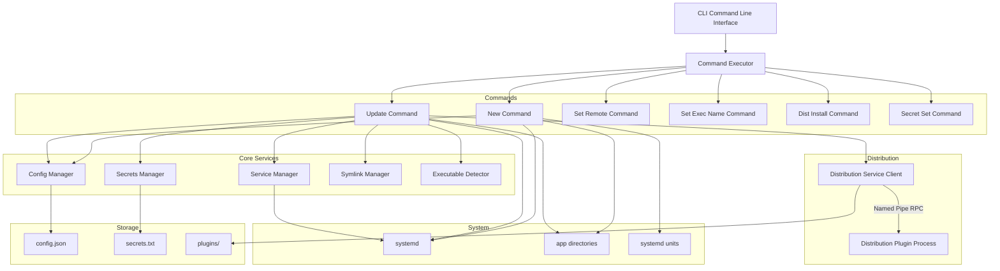
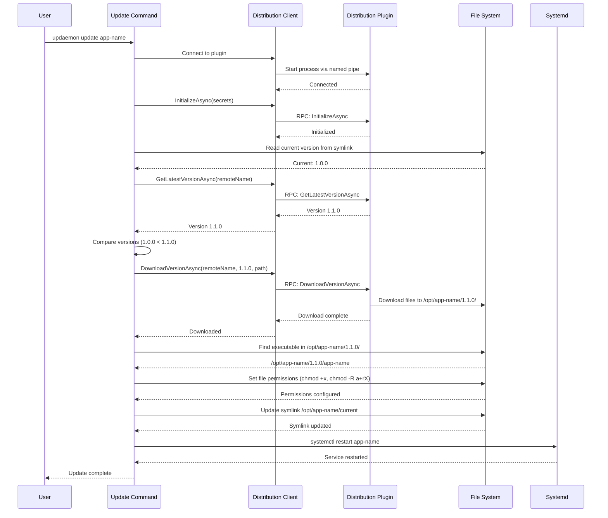
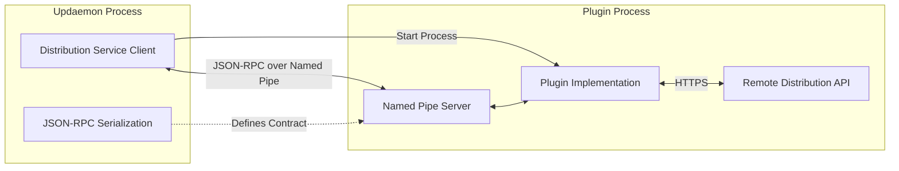
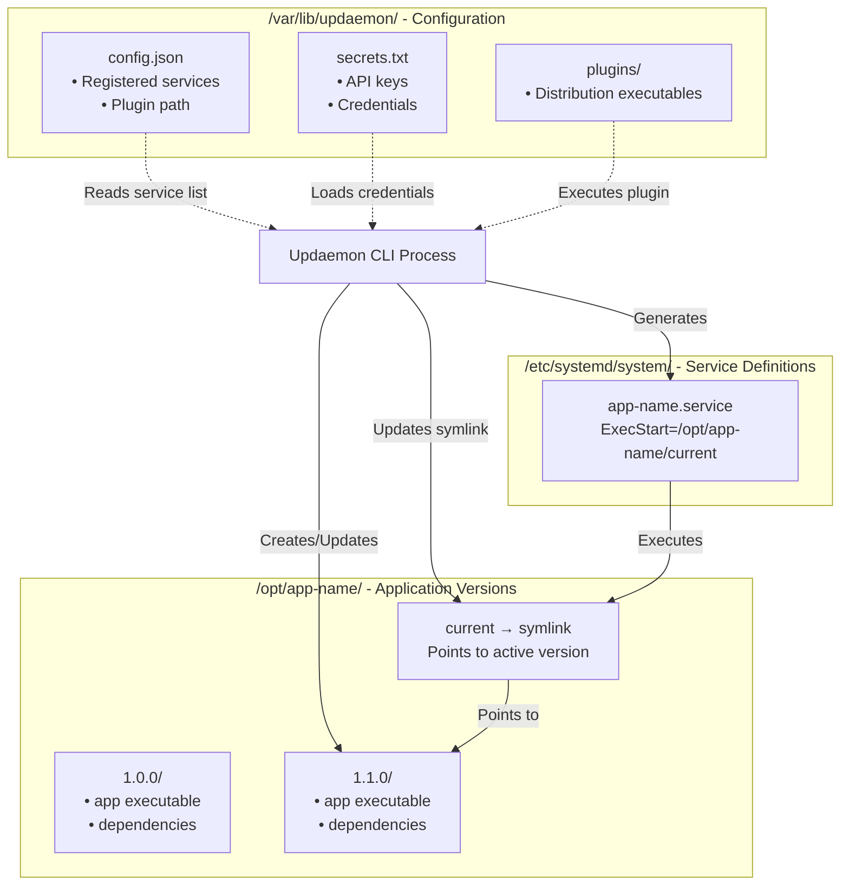
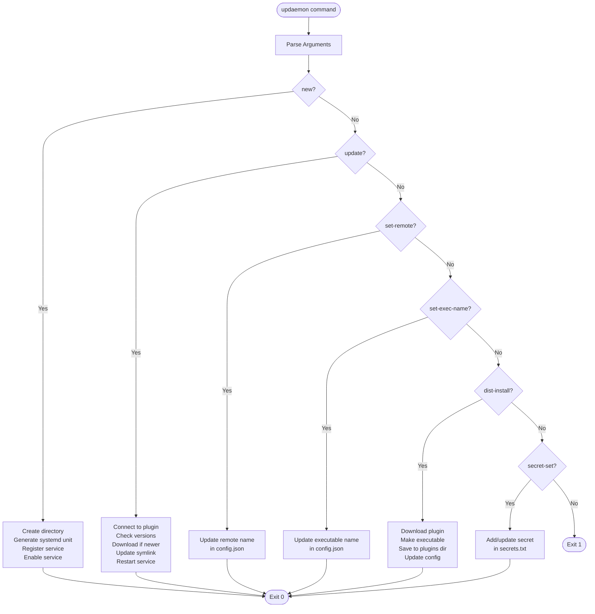

# Updaemon

<div align="center">
  
</div>

**Keep your Linux services and applications automatically up to date**

Updaemon is a simple tool that automatically updates your services and applications on Linux systems. It works with any distribution source (GitHub releases, custom servers, etc.) and handles the entire update process - from checking for new versions to restarting your services.

## What Updaemon Does

Updaemon makes it easy to keep your applications and services up to date on Linux:

- **Automatic Updates**: Checks for new versions and updates your services automatically
- **Zero Downtime**: Uses smart symlinks so your services keep running during updates
- **Works with Any Source**: Supports GitHub releases, custom servers, or any distribution method
- **Simple Setup**: Just install once and add your services with a single command
- **Scheduled Updates**: Set it to run automatically on a schedule
- **Safe & Reliable**: Keeps multiple versions so you can rollback if needed

## Table of Contents

**Getting Started:**
- [Installation](#installation)
- [Quick Start](#quick-start)
- [Usage](#usage)

**User Guide:**
- [CLI Commands](#cli-commands)
- [Configuration](#configuration)
- [Scheduling Updates](#scheduling-updates)

**For Developers:**
- [Creating Distribution Plugins](#creating-distribution-plugins)
- [System Architecture](#system-architecture)
- [Architecture Decisions](#architecture-decisions)

## Quick Start

Get up and running in minutes:

1. **Install Updaemon:**
   ```bash
   curl -fsSL https://raw.githubusercontent.com/AdamTovatt/updaemon/master/install.sh | sudo bash
   ```

2. **Install a distribution plugin (e.g., GitHub):**
   ```bash
   sudo updaemon dist-install https://github.com/AdamTovatt/updaemon/releases/download/v0.3.0/Updaemon.GithubDistributionService
   ```

3. **Add your first service:**
   ```bash
   sudo updaemon new my-app
   sudo updaemon set-remote my-app your-org/your-repo
   ```

4. **Update your service:**
   ```bash
   sudo updaemon update my-app
   ```

That's it! Your service is now managed by Updaemon and will be automatically updated.

## Installation
To install Updaemon, run the following command:

```bash
curl -fsSL https://raw.githubusercontent.com/AdamTovatt/updaemon/master/install.sh | sudo bash
```

That's it!

## Usage

After installing Updaemon you can invoke it with `updaemon` and additional commands / parameters. Running just `updaemon` without anything more will show a help section that explains how to use it. Or, you can read on here of course.

### Install a distribution plugin

To install a ditribution plugin you can run `updaemon dist-install [url]` with the `[url]` replaced by an actual url to a downloadable plugin. For example, if you want to be able to automatically update from GitHub releases you can install the plugin for that like this:

```bash
sudo updaemon dist-install https://github.com/AdamTovatt/updaemon/releases/download/v0.3.0/Updaemon.GithubDistributionService
```

```bash
sudo updaemon secret-set githubToken your-github-token-here
```

> [!NOTE]
> Setting a github token is not required for public repositories. It is required for private repositories and if you want to make frequent requests without being rate limited.

### Create a New Service

```bash
# Create a new managed service
sudo updaemon new my-api

# Optionally set a different remote name
sudo updaemon set-remote my-api Prod.MyApi
```

This will:
- Create `/opt/my-api/` directory
- Generate systemd unit file at `/etc/systemd/system/my-api.service`
- Enable the service
- Register it in updaemon's configuration

### Update Services

```bash
# Update all registered services
sudo updaemon update

# Update a specific service
sudo updaemon update my-api
```

The update process:
1. Connects to the distribution plugin
2. Checks the latest available version
3. Downloads the new version to `/opt/my-api/<version>/`
4. Sets file permissions (makes executable and sets directory access)
5. Updates the symlink `/opt/my-api/current`
6. Restarts the service

## Scheduling Updates

Set up automatic updates to run on a schedule using the built-in timer command:

```bash
# Set timer to run every 10 minutes
sudo updaemon timer 10m

# Set timer to run every hour
sudo updaemon timer 1h

# Check current timer status
sudo updaemon timer

# Disable automatic updates
sudo updaemon timer -
```

**Supported time formats:**
- `30s` - 30 seconds
- `5m` - 5 minutes  
- `1h` - 1 hour

The timer command automatically creates and manages the necessary systemd service and timer files.

## CLI Commands

### `updaemon new <app-name>`

Creates a new managed service with the specified name.

**Example:**
```bash
sudo updaemon new word-library-api
```

### `updaemon update [app-name]`

Updates all services or a specific service to the latest available version.

**Examples:**
```bash
sudo updaemon update                    # Update all services
sudo updaemon update word-library-api   # Update specific service
```

### `updaemon set-remote <app-name> <remote-name>`

Sets the remote name used when querying the distribution service for a specific app.

**Example:**
```bash
sudo updaemon set-remote word-library-api FastPackages.WordLibraryApi
```

### `updaemon set-exec-name <app-name> <executable-name>`

Sets the executable name for a specific app. This is useful when the actual executable name differs from the service name (e.g., service name is `pg-backup-agent` but executable is `PgBackupAgent`).

Use `-` as the executable name to clear this setting and revert to using the local name.

**Examples:**
```bash
# Set executable name
sudo updaemon set-exec-name pg-backup-agent PgBackupAgent

# Clear executable name (revert to using local name)
sudo updaemon set-exec-name pg-backup-agent -
```

### `updaemon dist-install <url>`

Downloads and installs a distribution service plugin from a URL.

**Example:**
```bash
sudo updaemon dist-install https://github.com/AdamTovatt/updaemon/releases/download/v0.3.0/Updaemon.GithubDistributionService
```

### `updaemon secret-set <key> <value>`

Sets a secret key-value pair for the distribution service.

**Example:**
```bash
sudo updaemon secret-set apiKey abc123xyz
sudo updaemon secret-set tenantId 550e8400-e29b-41d4-a716-446655440000
```

### `updaemon timer [interval]`

Manages automatic update scheduling using systemd timers.

**Examples:**
```bash
sudo updaemon timer 10m          # Set timer to run every 10 minutes
sudo updaemon timer 30s          # Set timer to run every 30 seconds
sudo updaemon timer 1h           # Set timer to run every hour
sudo updaemon timer              # Show current timer status
sudo updaemon timer -            # Disable automatic timer
```

**Supported time formats:**
- `30s` - 30 seconds
- `5m` - 5 minutes  
- `1h` - 1 hour

The timer will automatically run `updaemon update` at the specified interval.

[↑ Back to top](#updaemon)

## Configuration

Updaemon stores its configuration in `/var/lib/updaemon/`:

- **`config.json`** - Your registered services and plugin settings
- **`secrets.txt`** - API keys and credentials for distribution services
- **`plugins/`** - Downloaded distribution plugins
- **`default-unit.template`** - Customizable systemd service template

### Directory Structure

```
/var/lib/updaemon/
├── config.json              # Service registry and plugin configuration
├── secrets.txt              # Distribution service secrets (key=value format)
├── default-unit.template    # Default systemd unit file template (customizable)
└── plugins/
    └── <plugin-executable>  # Distribution service plugin

/opt/<service-name>/
├── 1.0.0/                   # Version 1.0.0 files
│   └── <executable>
├── 1.1.0/                   # Version 1.1.0 files
│   └── <executable>
└── current -> 1.1.0/        # Symlink to current version directory

/etc/systemd/system/
└── <service-name>.service   # systemd unit file
```

### Configuration Files

### /var/lib/updaemon/config.json

```json
{
  "distributionPluginPath": "/var/lib/updaemon/plugins/byteshelf-dist",
  "services": [
    {
      "localName": "word-library-api",
      "remoteName": "FastPackages.WordLibraryApi",
      "executableName": "WordLibraryApi"
    }
  ]
}
```

**Note:** The `executableName` field is optional. If not specified, the `localName` is used when searching for the executable.

### /var/lib/updaemon/secrets.txt

```
tenantId=550e8400-e29b-41d4-a716-446655440000
apiKey=abc123xyz
```

### /var/lib/updaemon/default-unit.template

This file contains the systemd unit file template used when creating new services with `updaemon new`. It is automatically created from an embedded default on first use, but you can customize it to match your needs.

**Placeholders:**
- `{SERVICE_NAME}` - The name of the service
- `{DESCRIPTION}` - A description of the service
- `{WORKING_DIRECTORY}` - The working directory for the service (the symlink path `/opt/<service>/current`)
- `{EXECUTABLE_NAME}` - The name of the executable file

**Example:**
```ini
[Unit]
Description={DESCRIPTION}
After=network.target

[Service]
Type=simple
WorkingDirectory={WORKING_DIRECTORY}
ExecStart={WORKING_DIRECTORY}/{EXECUTABLE_NAME}
Restart=always
RestartSec=10
StandardOutput=journal
StandardError=journal
SyslogIdentifier={SERVICE_NAME}

[Install]
WantedBy=multi-user.target
```

You can edit this file to add custom systemd directives like environment variables, resource limits, or security settings that will apply to all new services created with updaemon.

### App-specific Configuration (Optional)

Applications can include an `updaemon.json` file in their published output to provide hints to updaemon:

```json
{
  "executablePath": "bin/my-app"
}
```

[↑ Back to top](#updaemon)

## Creating Distribution Plugins

Distribution plugins are separate AOT-compiled executables that communicate with updaemon via named pipes using a JSON-RPC protocol. The contract is defined in the separate **Updaemon.Common** project.

### Quick Start

1. **Reference Updaemon.Common** in your plugin project.

2. **Implement IDistributionService**:
   ```csharp
   using Updaemon.Common;
   
   public class MyDistributionService : IDistributionService
   {
       public Task InitializeAsync(SecretCollection secrets, CancellationToken cancellationToken = default) { /* ... */ }
       public Task<Version?> GetLatestVersionAsync(string serviceName, CancellationToken cancellationToken = default) { /* ... */ }
       public Task DownloadVersionAsync(string serviceName, Version version, string targetPath, CancellationToken cancellationToken = default) { /* ... */ }
   }
   ```

3. **Host using DistributionServiceHost**:
   ```csharp
   using Updaemon.Common.Hosting;
   
   class Program
   {
       static async Task Main(string[] args)
       {
           await DistributionServiceHost.RunAsync(args, new MyDistributionService());
       }
   }
   ```

That's it! The `DistributionServiceHost` handles all the named pipe server infrastructure, argument parsing, RPC routing, and error handling automatically.

For detailed instructions and advanced options, see [Updaemon.Common/README.md](Updaemon.Common/README.md).

### Plugin Requirements

1. Reference the **Updaemon.Common** project or NuGet package
2. Implement the `IDistributionService` interface from `Updaemon.Common`
3. Accept `--pipe-name <name>` command-line argument
4. Host a named pipe server that handles JSON-RPC requests
5. Use `CommonJsonContext` for RPC serialization (AOT-compatible)
6. Be compiled as an AOT executable for Linux

### RPC Protocol

The RPC types (`RpcRequest` and `RpcResponse`) are defined in `Updaemon.Common.Rpc`:

**Request:**
```json
{
  "id": "unique-request-id",
  "method": "GetLatestVersionAsync",
  "parameters": "{\"serviceName\":\"MyApp\"}"
}
```

**Response:**
```json
{
  "id": "unique-request-id",
  "success": true,
  "result": "\"1.2.3\"",
  "error": null
}
```

**Important:** Use `Updaemon.Common.Serialization.CommonJsonContext` for serializing/deserializing RPC messages to ensure AOT compatibility.

[↑ Back to top](#updaemon)

## Architecture Decisions

### Why a Separate Common Project?

The **Updaemon.Common** project contains only the shared code between updaemon and distribution plugins:
- `IDistributionService` interface
- RPC message types (`RpcRequest`, `RpcResponse`)
- JSON serialization context for AOT compatibility
- Utility classes (e.g., `DownloadPostProcessor` for archive extraction)

**Benefits:**
- **Clean separation**: Plugin authors only reference what they need, not updaemon's entire codebase
- **Clear versioning**: The common library can be versioned independently
- **Reduced coupling**: Internal updaemon changes don't affect plugin authors
- **NuGet distribution**: Can be published as a standalone package for easy consumption
- **Better testing**: Plugins can test against a stable, minimal library
- **Shared utilities**: Common functionality like archive extraction can be reused across plugins

Without this separation, plugin authors would either need to reference the entire Updaemon project (pulling in unnecessary dependencies like command handlers, config managers, etc.) or manually recreate the interface definitions and utilities (risking version drift and errors).

### Why AOT Compilation?

Updaemon uses AOT (Ahead-of-Time) compilation instead of traditional JIT (Just-in-Time) compilation for several key reasons:

- **Lightning fast startup time**: As a one shot CLI tool that runs frequently (potentially on every update check), AOT provides near-instant startup with no JIT warmup overhead
- **Single executable deployment**: The entire application compiles to a single native binary, making installation as simple as copying one file
- **No runtime dependencies**: Target systems don't need the .NET runtime installed, reducing deployment complexity and system requirements
- **Lower memory footprint**: AOT binaries use less memory than JIT-compiled applications, important for a background service

### Why Pluggable Distribution Services?

Updaemon uses a plugin architecture for distribution services to maintain true flexibility:

- **Support diverse distribution methods**: Different organizations use different distribution systems (custom file servers, cloud storage, package registries, etc.)
- **No vendor lock-in**: Users can implement their own distribution service without modifying updaemon's core
- **Evolution over time**: New distribution methods can be added as they emerge without updating updaemon itself
- **Custom authentication**: Each plugin can handle its own authentication mechanisms (API keys, OAuth, certificates, etc.)

By separating service management and update decisions (updaemon core) from file acquisition and retrieval (distribution plugins), the system remains adaptable to any deployment workflow.

### Why Named Pipes with JSON-RPC Instead of DLL Plugins?

AOT compilation doesn't support dynamic assembly loading at runtime. Named pipes with JSON-RPC allow us to:
- Keep plugins as separate processes
- Maintain AOT compatibility (using System.Text.Json source generation)
- Isolate plugin failures from updaemon
- Support plugins written in any language
- Human-readable messages for debugging

### Why System.Version?

Using `System.Version` provides:
- Standardized semantic versioning
- Built-in comparison operators
- Clear contract between updaemon and plugins

### Why Symlinks?

Symlinks enable:
- Zero-downtime deployments
- Easy rollback (just repoint the symlink)
- Multiple versions coexisting on disk
- Atomic version switching

[↑ Back to top](#updaemon)

## System Architecture



[↑ Back to top](#updaemon)

## Update Flow



[↑ Back to top](#updaemon)

## Plugin Communication Architecture



[↑ Back to top](#updaemon)

## File System Data Flow



[↑ Back to top](#updaemon)

## CLI Command Flow



[↑ Back to top](#updaemon)

## License

MIT

