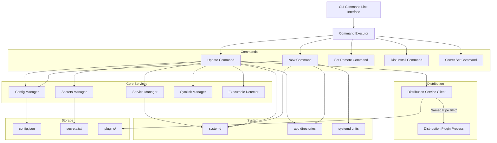
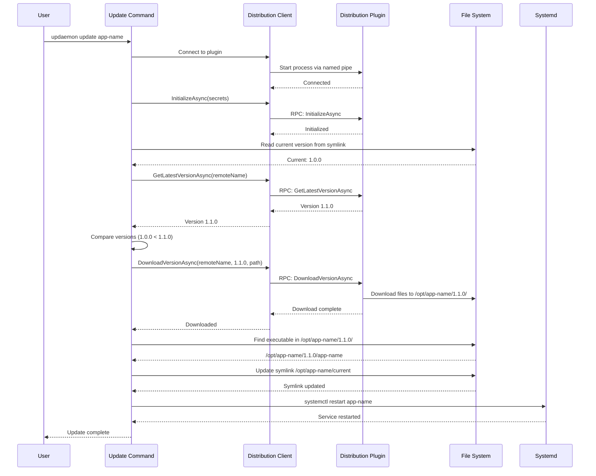
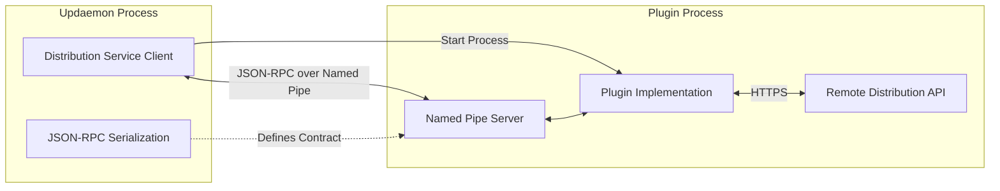
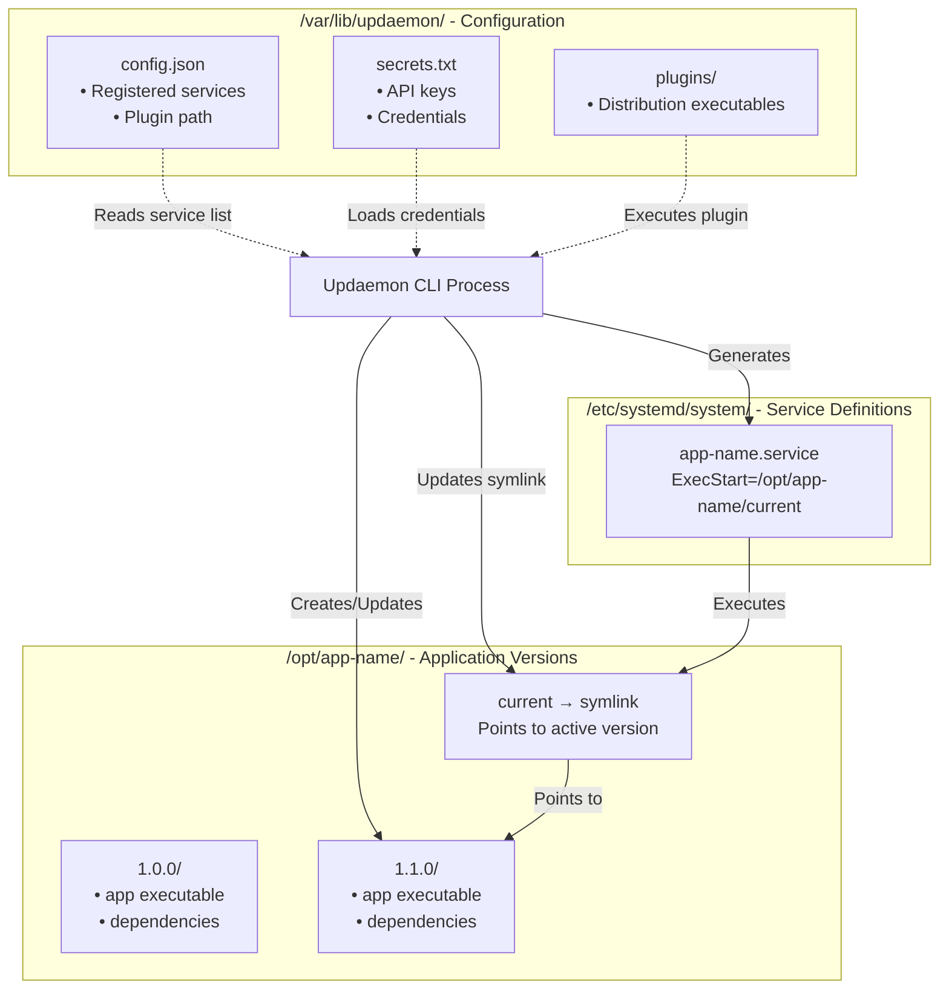
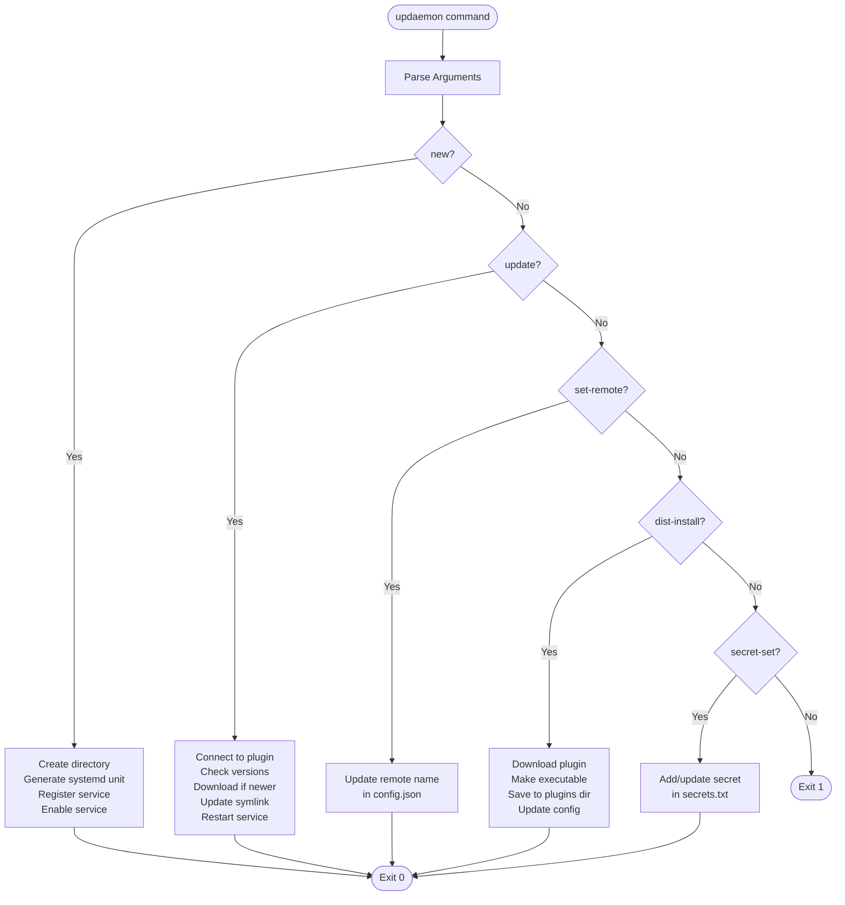

# Updaemon

A lightweight, AOT-compiled service update manager for Linux that automatically keeps your services up to date through pluggable distribution sources.

## Overview

Updaemon is a CLI-based update manager designed to:
- Manage versioned deployments of services in `/opt/<service-name>/`
- Support pluggable distribution services via named pipes (AOT-compatible)
- Automatically update services from remote distribution sources
- Manage systemd service files and lifecycle
- Use symlinks for zero-downtime version switching

## Table of Contents

**Visualizations:**
- [System Architecture](#system-architecture)
- [Update Flow](#update-flow)
- [Plugin Communication Architecture](#plugin-communication-architecture)
- [File System Data Flow](#file-system-data-flow)
- [CLI Command Flow](#cli-command-flow)

**Getting Started:**
- [Installation](#installation)
- [Usage](#usage)

**Reference:**
- [CLI Commands](#cli-commands)
- [Directory Structure](#directory-structure)
- [Configuration Files](#configuration-files)

**Advanced:**
- [Creating Distribution Plugins](#creating-distribution-plugins)
- [Architecture Decisions](#architecture-decisions)

## System Architecture



[↑ Back to top](#updaemon)

## Update Flow



[↑ Back to top](#updaemon)

## Plugin Communication Architecture



[↑ Back to top](#updaemon)

## File System Data Flow



[↑ Back to top](#updaemon)

## CLI Command Flow



[↑ Back to top](#updaemon)

## Installation

### Building from Source

```bash
# Clone the repository
git clone <repository-url>
cd Updaemon

# Publish as AOT-compiled executable
dotnet publish Updaemon/Updaemon.csproj -c Release

# The executable will be in: Updaemon/bin/Release/net8.0/linux-x64/publish/
```

### Installing Updaemon

```bash
# Copy to system location
sudo cp Updaemon/bin/Release/net8.0/linux-x64/publish/Updaemon /usr/local/bin/updaemon
sudo chmod +x /usr/local/bin/updaemon

# Create configuration directory
sudo mkdir -p /var/lib/updaemon/plugins
```

## Usage

### Install a Distribution Plugin

```bash
# Install a distribution service plugin
sudo updaemon dist-install https://example.com/byteshelf-plugin

# Configure plugin secrets
sudo updaemon secret-set tenantId your-tenant-id
sudo updaemon secret-set apiKey your-api-key
```

### Create a New Service

```bash
# Create a new managed service
sudo updaemon new my-api

# Optionally set a different remote name
sudo updaemon set-remote my-api Prod.MyApi
```

This will:
- Create `/opt/my-api/` directory
- Generate systemd unit file at `/etc/systemd/system/my-api.service`
- Enable the service
- Register it in updaemon's configuration

### Update Services

```bash
# Update all registered services
sudo updaemon update

# Update a specific service
sudo updaemon update my-api
```

The update process:
1. Connects to the distribution plugin
2. Checks the latest available version
3. Downloads the new version to `/opt/my-api/<version>/`
4. Updates the symlink `/opt/my-api/current`
5. Restarts the service

### Running Periodic Updates

You can configure updaemon to run periodically using systemd timers:

```bash
# Create timer unit file
sudo cat > /etc/systemd/system/updaemon.timer <<EOF
[Unit]
Description=Run updaemon update periodically

[Timer]
OnCalendar=hourly
Persistent=true

[Install]
WantedBy=timers.target
EOF

# Create service unit file
sudo cat > /etc/systemd/system/updaemon.service <<EOF
[Unit]
Description=Updaemon update service

[Service]
Type=oneshot
ExecStart=/usr/local/bin/updaemon update
EOF

# Enable and start the timer
sudo systemctl enable updaemon.timer
sudo systemctl start updaemon.timer
```

[↑ Back to top](#updaemon)

## CLI Commands

### `updaemon new <app-name>`

Creates a new managed service with the specified name.

**Example:**
```bash
sudo updaemon new word-library-api
```

### `updaemon update [app-name]`

Updates all services or a specific service to the latest available version.

**Examples:**
```bash
sudo updaemon update                    # Update all services
sudo updaemon update word-library-api   # Update specific service
```

### `updaemon set-remote <app-name> <remote-name>`

Sets the remote name used when querying the distribution service for a specific app.

**Example:**
```bash
sudo updaemon set-remote word-library-api FastPackages.WordLibraryApi
```

### `updaemon dist-install <url>`

Downloads and installs a distribution service plugin from a URL.

**Example:**
```bash
sudo updaemon dist-install https://example.com/plugins/byteshelf-dist
```

### `updaemon secret-set <key> <value>`

Sets a secret key-value pair for the distribution service.

**Example:**
```bash
sudo updaemon secret-set apiKey abc123xyz
sudo updaemon secret-set tenantId 550e8400-e29b-41d4-a716-446655440000
```

[↑ Back to top](#updaemon)

## Directory Structure

```
/var/lib/updaemon/
├── config.json              # Service registry and plugin configuration
├── secrets.txt              # Distribution service secrets (key=value format)
├── default-unit.template    # Default systemd unit file template (customizable)
└── plugins/
    └── <plugin-executable>  # Distribution service plugin

/opt/<service-name>/
├── 1.0.0/                   # Version 1.0.0 files
│   └── <executable>
├── 1.1.0/                   # Version 1.1.0 files
│   └── <executable>
└── current -> 1.1.0/<exe>   # Symlink to current version

/etc/systemd/system/
└── <service-name>.service   # systemd unit file
```

[↑ Back to top](#updaemon)

## Configuration Files

### /var/lib/updaemon/config.json

```json
{
  "distributionPluginPath": "/var/lib/updaemon/plugins/byteshelf-dist",
  "services": [
    {
      "localName": "word-library-api",
      "remoteName": "FastPackages.WordLibraryApi"
    }
  ]
}
```

### /var/lib/updaemon/secrets.txt

```
tenantId=550e8400-e29b-41d4-a716-446655440000
apiKey=abc123xyz
```

### /var/lib/updaemon/default-unit.template

This file contains the systemd unit file template used when creating new services with `updaemon new`. It is automatically created from an embedded default on first use, but you can customize it to match your needs.

**Placeholders:**
- `{SERVICE_NAME}` - The name of the service
- `{DESCRIPTION}` - A description of the service
- `{EXECUTABLE_PATH}` - The path to the executable (typically the symlink `/opt/<service>/current`)

**Example:**
```ini
[Unit]
Description={DESCRIPTION}
After=network.target

[Service]
Type=simple
ExecStart={EXECUTABLE_PATH}
Restart=always
RestartSec=10
StandardOutput=journal
StandardError=journal
SyslogIdentifier={SERVICE_NAME}

[Install]
WantedBy=multi-user.target
```

You can edit this file to add custom systemd directives like environment variables, resource limits, or security settings that will apply to all new services created with updaemon.

### App-specific Configuration (Optional)

Applications can include an `updaemon.json` file in their published output to provide hints to updaemon:

```json
{
  "executablePath": "bin/my-app"
}
```

[↑ Back to top](#updaemon)

## Creating Distribution Plugins

Distribution plugins are separate AOT-compiled executables that communicate with updaemon via named pipes using a JSON-RPC protocol. The contract is defined in the separate **Updaemon.Common** project.

### Quick Start

1. **Reference Updaemon.Common** in your plugin project.

2. **Implement IDistributionService**:
   ```csharp
   using Updaemon.Common;
   
   public class MyDistributionService : IDistributionService
   {
       public Task InitializeAsync(string? secrets) { /* ... */ }
       public Task<Version?> GetLatestVersionAsync(string serviceName) { /* ... */ }
       public Task DownloadVersionAsync(string serviceName, Version version, string targetPath) { /* ... */ }
   }
   ```

3. **Host a named pipe server** using the RPC types from `Updaemon.Common.Rpc`

4. **Use CommonJsonContext** from `Updaemon.Common.Serialization` for AOT-compatible JSON serialization

For detailed instructions and a complete example, see [Updaemon.Common/README.md](Updaemon.Common/README.md).

### Plugin Requirements

1. Reference the **Updaemon.Common** project or NuGet package
2. Implement the `IDistributionService` interface from `Updaemon.Common`
3. Accept `--pipe-name <name>` command-line argument
4. Host a named pipe server that handles JSON-RPC requests
5. Use `CommonJsonContext` for RPC serialization (AOT-compatible)
6. Be compiled as an AOT executable for Linux

### RPC Protocol

The RPC types (`RpcRequest` and `RpcResponse`) are defined in `Updaemon.Common.Rpc`:

**Request:**
```json
{
  "id": "unique-request-id",
  "method": "GetLatestVersionAsync",
  "parameters": "{\"serviceName\":\"MyApp\"}"
}
```

**Response:**
```json
{
  "id": "unique-request-id",
  "success": true,
  "result": "\"1.2.3\"",
  "error": null
}
```

**Important:** Use `Updaemon.Common.Serialization.CommonJsonContext` for serializing/deserializing RPC messages to ensure AOT compatibility.

[↑ Back to top](#updaemon)

## Architecture Decisions

### Why a Separate Common Project?

The **Updaemon.Common** project contains only the shared code between updaemon and distribution plugins:
- `IDistributionService` interface
- RPC message types (`RpcRequest`, `RpcResponse`)
- JSON serialization context for AOT compatibility

**Benefits:**
- **Clean separation**: Plugin authors only reference what they need, not updaemon's entire codebase
- **Clear versioning**: The common library can be versioned independently
- **Reduced coupling**: Internal updaemon changes don't affect plugin authors
- **NuGet distribution**: Can be published as a standalone package for easy consumption
- **Better testing**: Plugins can test against a stable, minimal library

Without this separation, plugin authors would either need to reference the entire Updaemon project (pulling in unnecessary dependencies like command handlers, config managers, etc.) or manually recreate the interface definitions (risking version drift and errors).

### Why AOT Compilation?

Updaemon uses AOT (Ahead-of-Time) compilation instead of traditional JIT (Just-in-Time) compilation for several key reasons:

- **Lightning fast startup time**: As a one shot CLI tool that runs frequently (potentially on every update check), AOT provides near-instant startup with no JIT warmup overhead
- **Single executable deployment**: The entire application compiles to a single native binary, making installation as simple as copying one file
- **No runtime dependencies**: Target systems don't need the .NET runtime installed, reducing deployment complexity and system requirements
- **Lower memory footprint**: AOT binaries use less memory than JIT-compiled applications, important for a background service

### Why Pluggable Distribution Services?

Updaemon uses a plugin architecture for distribution services to maintain true flexibility:

- **Support diverse distribution methods**: Different organizations use different distribution systems (custom file servers, cloud storage, package registries, etc.)
- **No vendor lock-in**: Users can implement their own distribution service without modifying updaemon's core
- **Evolution over time**: New distribution methods can be added as they emerge without updating updaemon itself
- **Custom authentication**: Each plugin can handle its own authentication mechanisms (API keys, OAuth, certificates, etc.)

By separating service management and update decisions (updaemon core) from file acquisition and retrieval (distribution plugins), the system remains adaptable to any deployment workflow.

### Why Named Pipes with JSON-RPC Instead of DLL Plugins?

AOT compilation doesn't support dynamic assembly loading at runtime. Named pipes with JSON-RPC allow us to:
- Keep plugins as separate processes
- Maintain AOT compatibility (using System.Text.Json source generation)
- Isolate plugin failures from updaemon
- Support plugins written in any language
- Human-readable messages for debugging

### Why System.Version?

Using `System.Version` provides:
- Standardized semantic versioning
- Built-in comparison operators
- Clear contract between updaemon and plugins

### Why Symlinks?

Symlinks enable:
- Zero-downtime deployments
- Easy rollback (just repoint the symlink)
- Multiple versions coexisting on disk
- Atomic version switching

[↑ Back to top](#updaemon)

## License

[Add your license here]

## Contributing

[Add contribution guidelines here]


