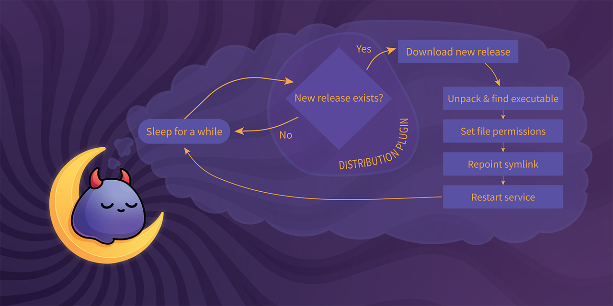
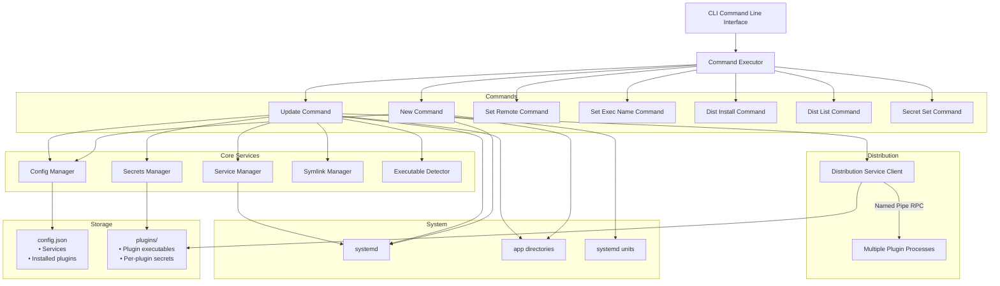
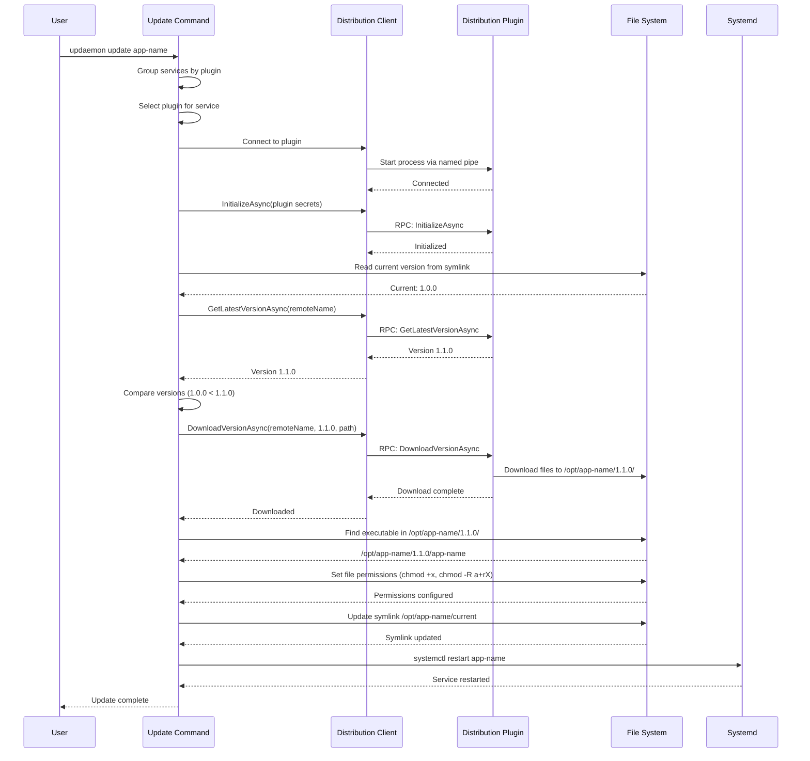
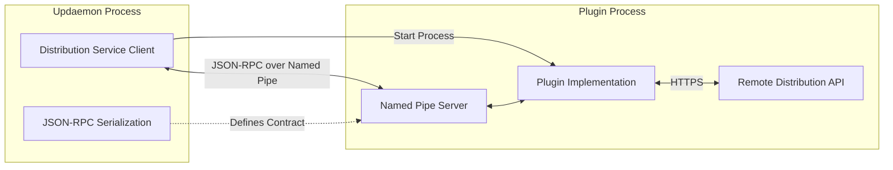
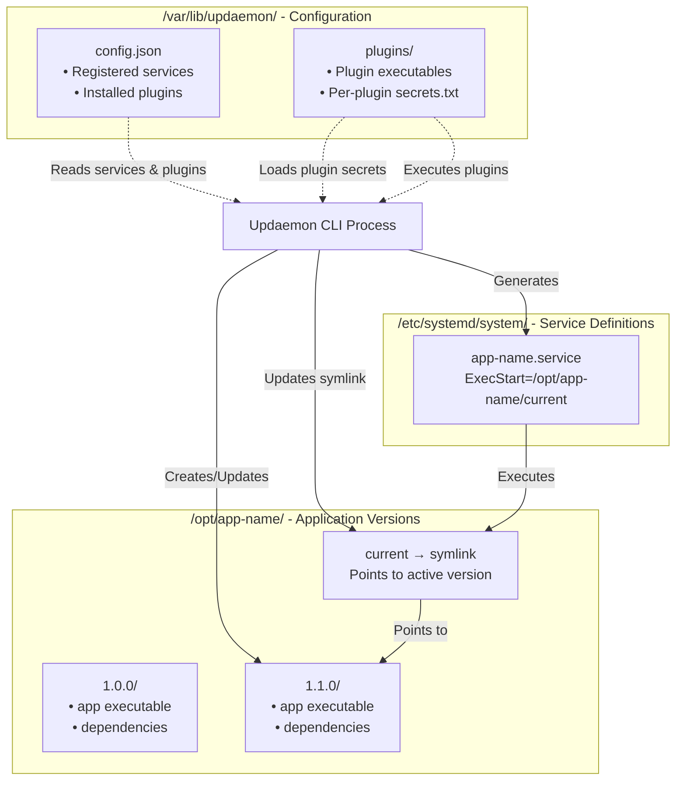
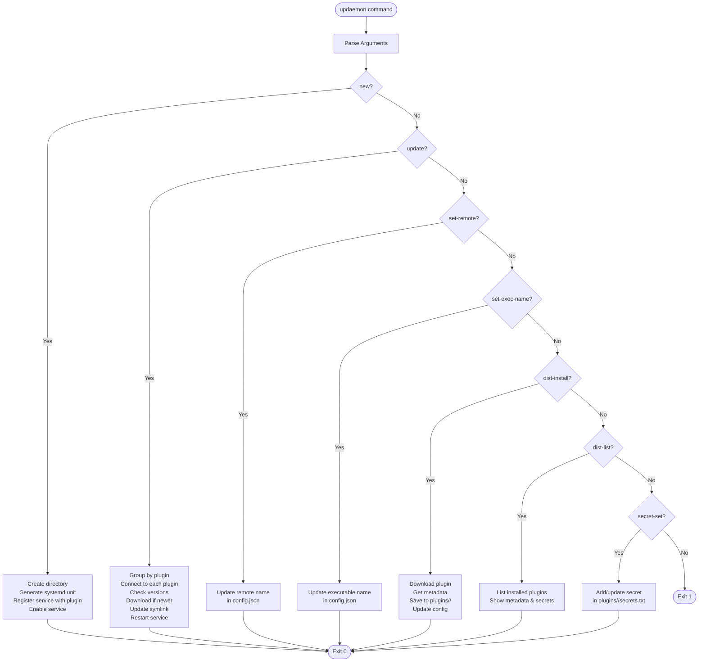
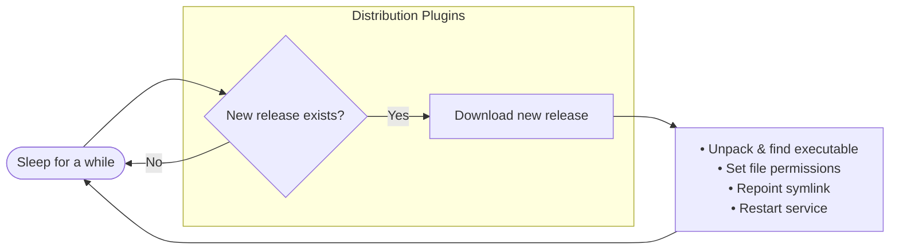

<div align="center">
  
</div>

# Updaemon 

[](https://github.com/AdamTovatt/updaemon/actions/workflows/dotnet.yml)

**Updaemon is a command line tool that helps you manage and update services and applications on Linux systems.**

For example:

Running `updaemon new my-service` creates a new systemctl service called `my-service` that is managed by Updaemon.

Then, `updaemon update` checks for new releases for all created services and updates them automatically if needed.

The new release is downloaded to a versioned folder and the symlink used by the service is updated to point to the new version.


Updaemon is extremely easy to [install](#getting-started) and can use any release distribution source (GitHub releases, custom servers, etc.). It handles the entire update process - from checking for new versions to restarting your services.


<div align="center">
  
</div>

## What Updaemon Does

Updaemon makes it easy to keep your applications and services up to date on Linux:

- **Automatic Updates**: Checks for new versions and updates your services automatically
- **Zero Downtime**: Uses symlinks so your services keep running during updates
- **Works with Any Source**: Supports GitHub releases, custom servers, or any distribution method
- **Simple Setup**: Just install once and add your services with a single command
- **Supports rollback**: Keeps multiple versions so you can rollback if needed

## Table of Contents

**Getting Started:**
- [Installing Updaemon](#getting-started)
- [Installing a Distribution Plugin](#installing-a-distribution-plugin)
- [Usage](#usage)

**User Guide:**
- [CLI Commands](#cli-commands)
- [Configuration](#configuration)
- [Scheduling Updates](#scheduling-updates)

**For Developers:**
- [Creating Distribution Plugins](#creating-distribution-plugins)
- [System Architecture](#system-architecture)
- [Architecture Decisions](#architecture-decisions)

## Getting Started
### Installation
To install Updaemon, run the following command:

```bash
curl -fsSL https://raw.githubusercontent.com/AdamTovatt/updaemon/master/install.sh | sudo bash
```

That's it! You can now use the `updaemon` command.

> [!TIP]
> Running the command `updaemon` without anything more will show a help section that explains usage.

### Installing a Distribution Plugin

A distribution plugin is like an extension for Updaemon that knows how to check for new versions and download files from a specific source (like GitHub releases).

```bash
sudo updaemon dist-install https://github.com/AdamTovatt/updaemon/releases/download/v0.5.1/Updaemon.GithubDistributionService
```

If you want to use multiple different distribution plugins you can do that too. See the cli documentation for the [dist-install](#dist-install-command) command for more details on that.

### Configuring Secrets For Distribution Plugins

Some distribution plugins might require secrets to run. Secrets are stored per plugin. Use the plugin alias with `secret-set`:

```bash
sudo updaemon secret-set github githubToken your-github-token-here
```

Here, `github` is the plugin alias, the key is `githubToken`, and the value should be your actual GitHub token. The set of secrets depends on the plugin — see the plugin's metadata or README.

> [!TIP]
> Setting a github token is not required for public repositories. It is required for private repositories and if you want to make frequent requests without being rate limited.

## Usage
Once you have Updaemon installed and a distribution plugin set up, you can start managing your services.

See the [`CLI commands`](#cli-commands) section below for a full list of available commands.

See the [`ServiceExample.md`](ServiceExample.md) for a complete example of setting up a simple service.

## CLI Commands

In this section you will find all available `updaemon` commands.

An argument in angle brackets (`< >`) indicates a required parameter, while square brackets (`[ ]`) indicate an optional parameter.

Commands that change files in the system usually require `sudo` to run.

| Command | Description |
| --- | --- |
| [new](#new-command) | Create a new managed service. |
| [update](#update-command) | Update all or a specific service to the latest version. |
| [set-remote](#set-remote-command) | Set the remote name used by the distribution plugin. |
| [set-exec-name](#set-exec-command) | Set or clear the executable name for a service. |
| [dist-install](#dist-install-command) | Download and install a distribution plugin (supports `--as`). |
| [dist-list](#dist-list-command) | List installed distribution plugins and their metadata. |
| [secret-set](#secret-set-command) | Set a secret key-value pair for a specific plugin. |
| [timer](#timer-command) | Manage automatic update scheduling using systemd timers. |

### New Command
```bash
updaemon new <app-name> --from <plugin-alias>
```

Creates a new managed service with the specified name and associates it with the distribution plugin identified by `<plugin-alias>`. Should be run with `sudo`.

### Update Command 

```bash
updaemon update [app-name]
```

Updates all services or a specific service to the latest available version. Should be run with `sudo`.

**Examples:**
```bash
sudo updaemon update                    # Update all services
sudo updaemon update word-library-api   # Update specific service
```

### Set-Remote Command

```bash
updaemon set-remote <app-name> <remote-name>
```

Sets the remote name used when querying a distribution service (plugin) for a specific app. The remote name is the name required by the distribution service to find the right file. By default, Updaemon uses the local app name (service name) as the remote name but adding a remote name might often be necessary depending on the distribution service used.

For example, consider a service called `my-api` that is published to GitHub releases. The GitHub distribution service can't know exactly which repository to look for just from the local service name. Therefore, you need to set the remote name to the GitHub repository name, e.g., `user-name/repo-name`.

**Example:**
```bash
sudo updaemon set-remote my-api user-name/repo-name
```
> [!NOTE]
> The remote name format depends on the distribution service used. Refer to the documentation of the specific distribution plugin for details on how to format the remote name. The example above is for the GitHub distribution service.

### Set-Exec Command

```
updaemon set-exec-name <app-name> <executable-name>
```

Sets the executable name for a specific app. This is useful when the actual executable name differs from the service name (e.g., service name is `my-api` but executable is `MyApi`).

Use `-` as the executable name to clear this setting and revert to using the local service name.

**Examples:**
```bash
# Set executable name
sudo updaemon set-exec-name my-api MyApi

# Clear executable name
sudo updaemon set-exec-name my-api -
```

#### Dist-Install Command
```bash
updaemon dist-install [--as <alias>] <url>
```

Downloads and installs a distribution service plugin from a URL. If `--as` is omitted, the plugin's default alias will be used.

**Examples:**
```bash
sudo updaemon dist-install --as github https://github.com/AdamTovatt/updaemon/releases/download/v0.3.0/Updaemon.GithubDistributionService
sudo updaemon dist-install https://github.com/AdamTovatt/updaemon/releases/download/v0.5.1/Updaemon.GithubDistributionService
```

#### Secret-Set Command
`updaemon secret-set <plugin-alias> <key> <value>`

Sets a secret key-value pair for a specific distribution plugin.

**Example:**
```bash
sudo updaemon secret-set github githubToken your-github-token-here
```

#### Dist-List Command
```bash
updaemon dist-list
```

Lists installed distribution plugins with their alias, full name, version, description, and required/optional secrets.

#### Timer Command
```bash
updaemon timer [interval]
```

Manages automatic update scheduling using systemd timers.

**Examples:**
```bash
sudo updaemon timer 10m          # Set timer to run every 10 minutes
sudo updaemon timer 30s          # Set timer to run every 30 seconds
sudo updaemon timer 1h           # Set timer to run every hour
sudo updaemon timer              # Show current timer status
sudo updaemon timer -            # Disable automatic timer
```

**Supported time formats:**
- `30s` - 30 seconds
- `5m` - 5 minutes  
- `1h` - 1 hour

The timer will automatically run `updaemon update` at the specified interval.

[↑ Back to top](#updaemon)

## Configuration

Updaemon stores its configuration in `/var/lib/updaemon/`:

- **`config.json`** - Your registered services and installed plugins
- **`plugins/`** - Downloaded distribution plugins and their per-plugin secrets
- **`default-unit.template`** - Customizable systemd service template

### Directory Structure

```
/var/lib/updaemon/
├── config.json                     # Service registry and installed plugins
├── default-unit.template           # Default systemd unit file template (customizable)
└── plugins/
    ├── github/
    │   ├── Updaemon.GithubDistributionService  # Plugin executable
    │   └── secrets.txt                          # Secrets for 'github' plugin
    └── byteshelf/
        ├── Updaemon.Distribution.ByteShelfDistribution
        └── secrets.txt

/opt/<service-name>/
├── 1.0.0/                   # Version 1.0.0 files
│   └── <executable>
├── 1.1.0/                   # Version 1.1.0 files
│   └── <executable>
└── current -> 1.1.0/        # Symlink to current version directory

/etc/systemd/system/
└── <service-name>.service   # systemd unit file
```

### Configuration Files

### /var/lib/updaemon/config.json

```json
{
  "installedPlugins": {
    "github": {
      "alias": "github",
      "path": "/var/lib/updaemon/plugins/github/Updaemon.GithubDistributionService"
    }
  },
  "services": [
    {
      "localName": "word-library-api",
      "remoteName": "FastPackages.WordLibraryApi",
      "executableName": "WordLibraryApi",
      "distributionPluginAlias": "github"
    }
  ]
}
```

**Note:** The `executableName` field is optional. If not specified, the `localName` is used when searching for the executable.

### /var/lib/updaemon/plugins/<alias>/secrets.txt

Each plugin has its own `secrets.txt` with `key=value` pairs. Example for `github`:

```
githubToken=ghp_abc123
```

### /var/lib/updaemon/default-unit.template

This file contains the systemd unit file template used when creating new services with `updaemon new`. It is automatically created from an embedded default on first use, but you can customize it to match your needs.

**Placeholders:**
- `{SERVICE_NAME}` - The name of the service
- `{DESCRIPTION}` - A description of the service
- `{WORKING_DIRECTORY}` - The working directory for the service (the symlink path `/opt/<service>/current`)
- `{EXECUTABLE_NAME}` - The name of the executable file

**Example:**
```ini
[Unit]
Description={DESCRIPTION}
After=network.target

[Service]
Type=simple
WorkingDirectory={WORKING_DIRECTORY}
ExecStart={WORKING_DIRECTORY}/{EXECUTABLE_NAME}
Restart=always
RestartSec=10
StandardOutput=journal
StandardError=journal
SyslogIdentifier={SERVICE_NAME}

[Install]
WantedBy=multi-user.target
```

You can edit this file to add custom systemd directives like environment variables, resource limits, or security settings that will apply to all new services created with updaemon.

### App-specific Configuration (Optional)

Applications can include an `updaemon.json` file in their published output to provide hints to updaemon:

```json
{
  "executablePath": "bin/my-app"
}
```

[↑ Back to top](#updaemon)

## Creating Distribution Plugins

Distribution plugins are separate AOT-compiled executables that communicate with updaemon via named pipes using a JSON-RPC protocol. The contract is defined in the separate **Updaemon.Common** project.

### Quick Start

1. **Reference Updaemon.Common** in your plugin project.

2. **Implement IDistributionService**:
   ```csharp
   using Updaemon.Common;
   
   public class MyDistributionService : IDistributionService
   {
       public Task InitializeAsync(SecretCollection secrets, CancellationToken cancellationToken = default) { /* ... */ }
       public Task<Version?> GetLatestVersionAsync(string serviceName, CancellationToken cancellationToken = default) { /* ... */ }
       public Task DownloadVersionAsync(string serviceName, Version version, string targetPath, CancellationToken cancellationToken = default) { /* ... */ }
   }
   ```

3. **Host using DistributionServiceHost**:
   ```csharp
   using Updaemon.Common.Hosting;
   
   class Program
   {
       static async Task Main(string[] args)
       {
           await DistributionServiceHost.RunAsync(args, new MyDistributionService());
       }
   }
   ```

That's it! The `DistributionServiceHost` handles all the named pipe server infrastructure, argument parsing, RPC routing, and error handling automatically.

For detailed instructions and advanced options, see [Updaemon.Common/README.md](Updaemon.Common/README.md).

### Plugin Requirements

1. Reference the **Updaemon.Common** project or NuGet package
2. Implement the `IDistributionService` interface from `Updaemon.Common`
3. Accept `--pipe-name <name>` command-line argument
4. Host a named pipe server that handles JSON-RPC requests
5. Use `CommonJsonContext` for RPC serialization (AOT-compatible)
6. Be compiled as an AOT executable for Linux

### RPC Protocol

The RPC types (`RpcRequest` and `RpcResponse`) are defined in `Updaemon.Common.Rpc`:

**Request:**
```json
{
  "id": "unique-request-id",
  "method": "GetLatestVersionAsync",
  "parameters": "{\"serviceName\":\"MyApp\"}"
}
```

**Response:**
```json
{
  "id": "unique-request-id",
  "success": true,
  "result": "\"1.2.3\"",
  "error": null
}
```

**Important:** Use `Updaemon.Common.Serialization.CommonJsonContext` for serializing/deserializing RPC messages to ensure AOT compatibility.

[↑ Back to top](#updaemon)

## Architecture Decisions

### Why a Separate Common Project?

The **Updaemon.Common** project contains only the shared code between updaemon and distribution plugins:
- `IDistributionService` interface
- RPC message types (`RpcRequest`, `RpcResponse`)
- JSON serialization context for AOT compatibility
- Utility classes (e.g., `DownloadPostProcessor` for archive extraction)

**Benefits:**
- **Clean separation**: Plugin authors only reference what they need, not updaemon's entire codebase
- **Clear versioning**: The common library can be versioned independently
- **Reduced coupling**: Internal updaemon changes don't affect plugin authors
- **NuGet distribution**: Can be published as a standalone package for easy consumption
- **Better testing**: Plugins can test against a stable, minimal library
- **Shared utilities**: Common functionality like archive extraction can be reused across plugins

Without this separation, plugin authors would either need to reference the entire Updaemon project (pulling in unnecessary dependencies like command handlers, config managers, etc.) or manually recreate the interface definitions and utilities (risking version drift and errors).

### Why AOT Compilation?

Updaemon uses AOT (Ahead-of-Time) compilation instead of traditional JIT (Just-in-Time) compilation for several key reasons:

- **Lightning fast startup time**: As a one shot CLI tool that runs frequently (potentially on every update check), AOT provides near-instant startup with no JIT warmup overhead
- **Single executable deployment**: The entire application compiles to a single native binary, making installation as simple as copying one file
- **No runtime dependencies**: Target systems don't need the .NET runtime installed, reducing deployment complexity and system requirements
- **Lower memory footprint**: AOT binaries use less memory than JIT-compiled applications, important for a background service

### Why Pluggable Distribution Services?

Updaemon uses a plugin architecture for distribution services to maintain true flexibility:

- **Support diverse distribution methods**: Different organizations use different distribution systems (custom file servers, cloud storage, package registries, etc.)
- **No vendor lock-in**: Users can implement their own distribution service without modifying updaemon's core
- **Evolution over time**: New distribution methods can be added as they emerge without updating updaemon itself
- **Custom authentication**: Each plugin can handle its own authentication mechanisms (API keys, OAuth, certificates, etc.)

By separating service management and update decisions (updaemon core) from file acquisition and retrieval (distribution plugins), the system remains adaptable to any deployment workflow.

### Why Named Pipes with JSON-RPC Instead of DLL Plugins?

AOT compilation doesn't support dynamic assembly loading at runtime. Named pipes with JSON-RPC allow us to:
- Keep plugins as separate processes
- Maintain AOT compatibility (using System.Text.Json source generation)
- Isolate plugin failures from updaemon
- Support plugins written in any language
- Human-readable messages for debugging

### Why System.Version?

Using `System.Version` provides:
- Standardized semantic versioning
- Built-in comparison operators
- Clear contract between updaemon and plugins

### Why Symlinks?

Symlinks enable:
- Zero-downtime deployments
- Easy rollback (just repoint the symlink)
- Multiple versions coexisting on disk
- Atomic version switching

[↑ Back to top](#updaemon)

## System Architecture


```mermaid
graph TB
    CLI[CLI Command Line Interface]
    Executor[Command Executor]
    
    subgraph Commands
        NewCmd[New Command]
        UpdateCmd[Update Command]
        SetRemoteCmd[Set Remote Command]
        SetExecNameCmd[Set Exec Name Command]
        DistInstallCmd[Dist Install Command]
        DistListCmd[Dist List Command]
        SecretSetCmd[Secret Set Command]
    end
    
    subgraph Core Services
        ConfigMgr[Config Manager]
        SecretsMgr[Secrets Manager]
        ServiceMgr[Service Manager]
        SymlinkMgr[Symlink Manager]
        ExecDetector[Executable Detector]
    end
    
    subgraph Distribution
        DistClient[Distribution Service Client]
        Plugins[Multiple Plugin Processes]
    end
    
    subgraph Storage
        ConfigFile["config.json<br/>• Services<br/>• Installed plugins"]
        PluginFiles["plugins/<br/>• Plugin executables<br/>• Per-plugin secrets"]
    end
    
    subgraph System
        Systemd[systemd]
        OptDir["app directories"]
        EtcDir["systemd units"]
    end
    
    CLI --> Executor
    Executor --> NewCmd
    Executor --> UpdateCmd
    Executor --> SetRemoteCmd
    Executor --> SetExecNameCmd
    Executor --> DistInstallCmd
    Executor --> DistListCmd
    Executor --> SecretSetCmd
    
    NewCmd --> ConfigMgr
    UpdateCmd --> ConfigMgr
    UpdateCmd --> SecretsMgr
    UpdateCmd --> ServiceMgr
    UpdateCmd --> SymlinkMgr
    UpdateCmd --> ExecDetector
    UpdateCmd --> DistClient
    
    ConfigMgr --> ConfigFile
    SecretsMgr --> PluginFiles
    
    DistClient -->|Named Pipe RPC| Plugins
    DistClient --> PluginFiles
    
    NewCmd --> Systemd
    UpdateCmd --> Systemd
    ServiceMgr --> Systemd
    NewCmd --> OptDir
    UpdateCmd --> OptDir
    NewCmd --> EtcDir
```

[↑ Back to top](#updaemon)

## Update Flow


```mermaid
sequenceDiagram
    participant User
    participant UpdateCmd as Update Command
    participant DistClient as Distribution Client
    participant Plugin as Distribution Plugin
    participant FileSystem as File System
    participant Systemd
    
    User->>UpdateCmd: updaemon update app-name
    UpdateCmd->>UpdateCmd: Group services by plugin
    UpdateCmd->>UpdateCmd: Select plugin for service
    UpdateCmd->>DistClient: Connect to plugin
    DistClient->>Plugin: Start process via named pipe
    Plugin-->>DistClient: Connected
    
    UpdateCmd->>DistClient: InitializeAsync(plugin secrets)
    DistClient->>Plugin: RPC: InitializeAsync
    Plugin-->>DistClient: Initialized
    
    UpdateCmd->>FileSystem: Read current version from symlink
    FileSystem-->>UpdateCmd: Current: 1.0.0
    
    UpdateCmd->>DistClient: GetLatestVersionAsync(remoteName)
    DistClient->>Plugin: RPC: GetLatestVersionAsync
    Plugin-->>DistClient: Version 1.1.0
    DistClient-->>UpdateCmd: Version 1.1.0
    
    UpdateCmd->>UpdateCmd: Compare versions (1.0.0 < 1.1.0)
    
    UpdateCmd->>DistClient: DownloadVersionAsync(remoteName, 1.1.0, path)
    DistClient->>Plugin: RPC: DownloadVersionAsync
    Plugin->>FileSystem: Download files to /opt/app-name/1.1.0/
    Plugin-->>DistClient: Download complete
    DistClient-->>UpdateCmd: Downloaded
    
    UpdateCmd->>FileSystem: Find executable in /opt/app-name/1.1.0/
    FileSystem-->>UpdateCmd: /opt/app-name/1.1.0/app-name
    
    UpdateCmd->>FileSystem: Set file permissions (chmod +x, chmod -R a+rX)
    FileSystem-->>UpdateCmd: Permissions configured
    
    UpdateCmd->>FileSystem: Update symlink /opt/app-name/current
    FileSystem-->>UpdateCmd: Symlink updated
    
    UpdateCmd->>Systemd: systemctl restart app-name
    Systemd-->>UpdateCmd: Service restarted
    
    UpdateCmd-->>User: Update complete
```

[↑ Back to top](#updaemon)

## Plugin Communication Architecture


```mermaid
graph LR
    subgraph Updaemon Process
        DistClient[Distribution Service Client]
        RpcLayer[JSON-RPC Serialization]
    end
    
    subgraph Plugin Process
        NamedPipe[Named Pipe Server]
        PluginImpl[Plugin Implementation]
        RemoteAPI[Remote Distribution API]
    end
    
    DistClient -->|Start Process| PluginImpl
    DistClient <-->|JSON-RPC over Named Pipe| NamedPipe
    NamedPipe <--> PluginImpl
    PluginImpl <-->|HTTPS| RemoteAPI
    
    RpcLayer -.->|Defines Contract| NamedPipe
```

[↑ Back to top](#updaemon)

## File System Data Flow


```mermaid
graph TB
    subgraph "/var/lib/updaemon/ - Configuration"
        ConfigJson["config.json<br/>• Registered services<br/>• Installed plugins"]
        PluginsDir["plugins/<br/>• Plugin executables<br/>• Per-plugin secrets.txt"]
    end
    
    subgraph "/opt/app-name/ - Application Versions"
        V100["1.0.0/<br/>• app executable<br/>• dependencies"]
        V110["1.1.0/<br/>• app executable<br/>• dependencies"]
        Current["current → symlink<br/>Points to active version"]
    end
    
    subgraph "/etc/systemd/system/ - Service Definitions"
        UnitFile["app-name.service<br/>ExecStart=/opt/app-name/current"]
    end
    
    ConfigJson -.->|Reads services & plugins| Updaemon[Updaemon CLI Process]
    PluginsDir -.->|Loads plugin secrets| Updaemon
    PluginsDir -.->|Executes plugins| Updaemon
    
    Updaemon -->|Creates/Updates| V110
    Updaemon -->|Updates symlink| Current
    Updaemon -->|Generates| UnitFile
    
    UnitFile -->|Executes| Current
    Current -->|Points to| V110
```

[↑ Back to top](#updaemon)

## CLI Command Flow


```mermaid
graph TD
    Start([updaemon command])
    Parse[Parse Arguments]
    
    New{new?}
    Update{update?}
    SetRemote{set-remote?}
    SetExecName{set-exec-name?}
    DistInstall{dist-install?}
    DistList{dist-list?}
    SecretSet{secret-set?}
    
    NewAction[Create directory<br/>Generate systemd unit<br/>Register service with plugin<br/>Enable service]
    UpdateAction[Group by plugin<br/>Connect to each plugin<br/>Check versions<br/>Download if newer<br/>Update symlink<br/>Restart service]
    SetRemoteAction[Update remote name<br/>in config.json]
    SetExecNameAction[Update executable name<br/>in config.json]
    DistInstallAction[Download plugin<br/>Get metadata<br/>Save to plugins/<alias>/<br/>Update config]
    DistListAction[List installed plugins<br/>Show metadata & secrets]
    SecretSetAction[Add/update secret<br/>in plugins/<alias>/secrets.txt]
    
    Success([Exit 0])
    Error([Exit 1])
    
    Start --> Parse
    Parse --> New
    New -->|Yes| NewAction
    New -->|No| Update
    Update -->|Yes| UpdateAction
    Update -->|No| SetRemote
    SetRemote -->|Yes| SetRemoteAction
    SetRemote -->|No| SetExecName
    SetExecName -->|Yes| SetExecNameAction
    SetExecName -->|No| DistInstall
    DistInstall -->|Yes| DistInstallAction
    DistInstall -->|No| DistList
    DistList -->|Yes| DistListAction
    DistList -->|No| SecretSet
    SecretSet -->|Yes| SecretSetAction
    SecretSet -->|No| Error
    
    NewAction --> Success
    UpdateAction --> Success
    SetRemoteAction --> Success
    SetExecNameAction --> Success
    DistInstallAction --> Success
    DistListAction --> Success
    SecretSetAction --> Success
```

[↑ Back to top](#updaemon)

## High Level Overview


```mermaid
graph LR
    A([Sleep for a while])
    subgraph Distribution Plugins
        B{New release exists?}
        C[Download new release]
    end
    D["• Unpack & find executable<br/>• Set file permissions<br/>• Repoint symlink<br/>• Restart service"]

    A --> B
    B -->|Yes| C
    B -->|No| A
    C --> D --> A
```

[↑ Back to top](#updaemon)

## License

MIT

