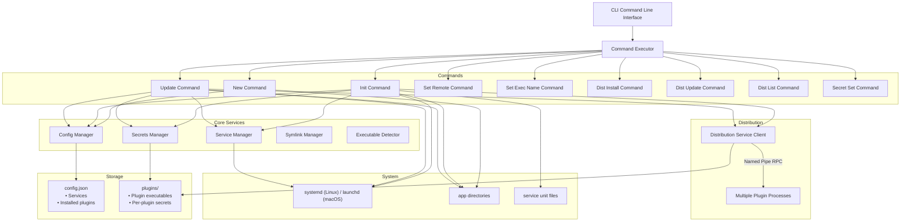
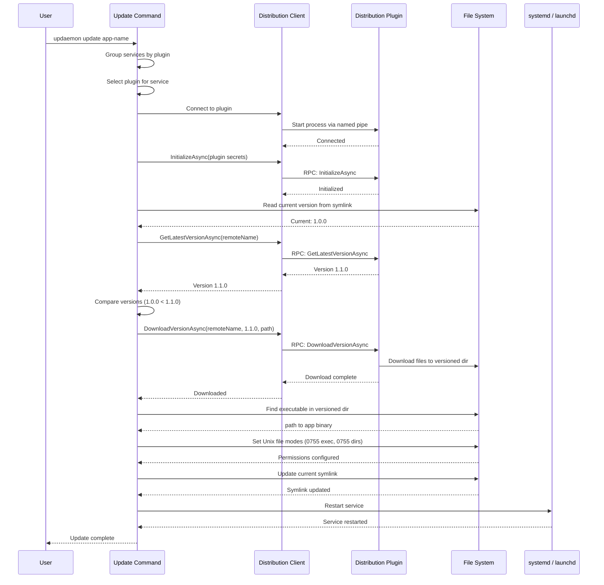
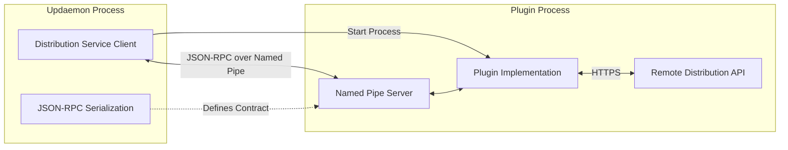
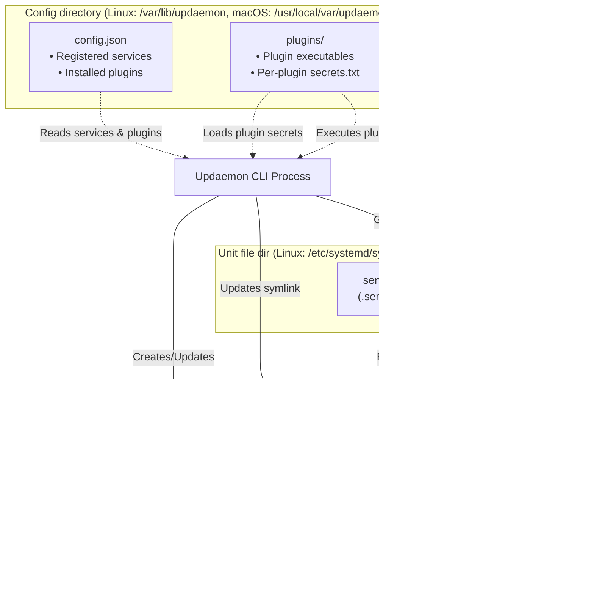
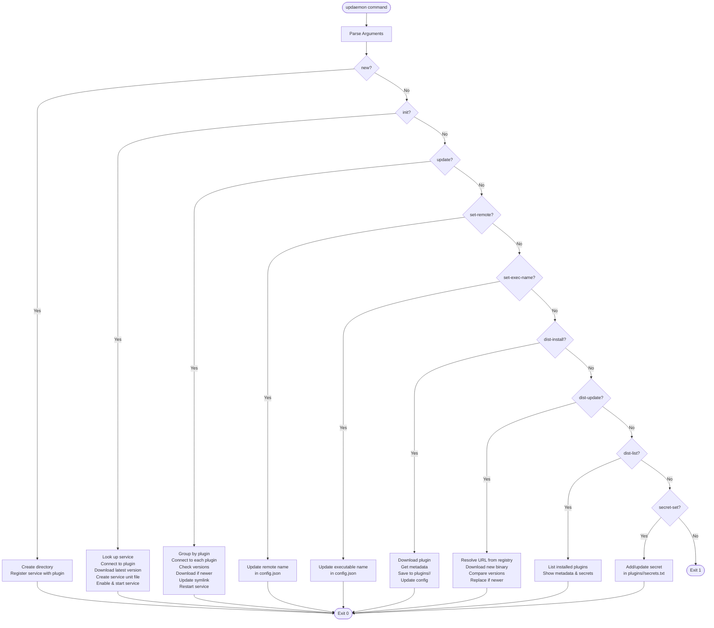

<div align="center">
  
</div>

# Updaemon 

[](https://github.com/AdamTovatt/updaemon/actions/workflows/dotnet.yml)

**Updaemon is a command line tool that helps you manage and update services and applications on Linux and macOS systems.**

It uses systemd on Linux and launchd (LaunchDaemons) on macOS, so the same commands work on both — `updaemon init my-service` writes the right unit file for the platform you're on.

For example:

Running `updaemon new my-service --from github` registers a new service called `my-service`, then `updaemon init my-service` downloads the latest version, creates the service unit file (systemd `.service` on Linux, launchd `.plist` on macOS), and starts it.

After that, `updaemon update` checks for new releases for all services and updates them automatically if needed.

The new release is downloaded to a versioned folder and the symlink used by the service is updated to point to the new version. This allows for both rollbacks and zero downtime.


Updaemon is extremely easy to [install](#getting-started) and can use any release distribution source (GitHub releases, custom servers, etc.). It handles the entire update process - from checking for new versions to restarting your services.


<div align="center">
  
</div>

## Features of Updaemon

Updaemon consists of two parts: the core part and the distribution plugin(s). One or more distribution plugins can be installed after the core part has been installed. Custom distribution plugins can also be developed and installed.

Updaemon makes it easy to keep your applications and services up to date on Linux and macOS:

- **Automatic Updates**: Checks for new versions and updates your services automatically
- **Zero Downtime**: Uses symlinks so your services keep running during updates
- **Works with Any Source**: Supports GitHub releases, custom servers, or any distribution method
- **Simple Setup**: Just install once with a single command, absolutely zero dependencies
- **Supports rollback**: Keeps multiple versions so you can rollback if needed
- **Native binary code**: Complied to native code that has low memory and CPU overhead

## Publishing with Updaemon

If you're interested in publishing your application to work with Updaemon, see [PublishingWithUpdaemon.md](PublishingWithUpdaemon.md) for details about how to structure your releases and use the `updaemon.json` configuration file. Using the `updaemon.json` file is optional, but could be useful.

## Table of Contents

**Getting Started:**
- [Installing Updaemon](#getting-started)
- [Installing a Distribution Plugin](#installing-a-distribution-plugin)
- [Usage](#usage)

**User Guide:**
- [CLI Commands](#cli-commands)
- [Configuration](#configuration)
- [Scheduling Updates (Timer command)](#timer-command)

**For Developers:**
- [Creating Distribution Plugins](#creating-distribution-plugins)
- [System Architecture](#system-architecture)
- [Architecture Decisions](#architecture-decisions)

## Getting Started
### Installation
> [!NOTE]
> Updaemon is still in early and active development. Commands and ways of doing things could change.
> Don't hesitate to reach out if there is a specific feature you think is missing.

To install Updaemon, run the following command:

```bash
curl -fsSL https://raw.githubusercontent.com/AdamTovatt/updaemon/master/install.sh | sudo bash
```

That's it! You can now use the `updaemon` command.

> [!TIP]
> Running the command `updaemon` without arguments will show a help section. You can also use `updaemon help` for general help or `updaemon help <command>` for detailed help on a specific command.

### Installing a Distribution Plugin

A distribution plugin is like an extension for Updaemon that knows how to check for new versions and download files from a specific source (like GitHub releases).

To install the distribution plugin for publishing using GitHub releases run this:

```bash
sudo updaemon dist-install github
```

If you want to use multiple different distribution plugins you can do that too.
If you want to install a distribution plugin using a direct downloadlink you can do that too.
See the cli documentation for the [dist-install](#dist-install-command) command for more in depth information.

### Configuring Secrets For Distribution Plugins

Some distribution plugins might require secrets to run. Secrets are stored per plugin. Use the plugin alias with `secret-set`:

```bash
sudo updaemon secret-set github githubToken your-github-token-here
```

Here, `github` is the plugin alias, the key is `githubToken`, and the value should be your actual GitHub token. The set of secrets depends on the plugin — see the plugin's metadata or README.

> [!TIP]
> Setting a github token is not required for public repositories. It is required for private repositories and if you want to make frequent requests without being rate limited.

## Usage
Once you have Updaemon installed and a distribution plugin set up, you can start managing your services.

See the [`CLI commands`](#cli-commands) section below for a full list of available commands.

See the [`ServiceExample.md`](ServiceExample.md) for a complete example of setting up a simple service.

## CLI Commands

In this section you will find all available `updaemon` commands.

An argument in angle brackets (`< >`) indicates a required parameter, while square brackets (`[ ]`) indicate an optional parameter.

Commands that change files in the system usually require `sudo` to run.

| Command | Description |
| --- | --- |
| [new](#new-command) | Register a new managed service. |
| [init](#init-command) | Download and set up a registered service for the first time. |
| [list](#list-command) | List all registered applications with version and status. |
| [update](#update-command) | Update all or a specific service to the latest version. |
| [set-remote](#set-remote-command) | Set the remote name used by the distribution plugin. |
| [set-exec-name](#set-exec-command) | Set or clear the executable name for a service. |
| [set-restart](#set-restart-command) | Set restart behavior after update (auto/manual). |
| [dist-install](#dist-install-command) | Download and install a distribution plugin (supports `--as`). |
| [dist-update](#dist-update-command) | Update installed distribution plugins. |
| [dist-list](#dist-list-command) | List installed distribution plugins and their metadata. |
| [secret-set](#secret-set-command) | Set a secret key-value pair for a specific plugin. |
| [timer](#timer-command) | Manage automatic update scheduling (systemd timer on Linux, launchd plist on macOS). |
| [help](#help-command) | Show help information for commands. |

### New Command
```bash
updaemon new <app-name> --from <plugin-alias> [--remote <remote-name>]
```

Registers a new service with the specified name and associates it with the distribution plugin identified by `<plugin-alias>`. This only creates the service directory and registers it in the updaemon config — it does not download anything or create a service unit file. Run `updaemon init <app-name>` after this to download and set up the service.

**Examples:**
```bash
sudo updaemon new my-api --from github
sudo updaemon new my-api --from github --remote owner/repo
```

### Init Command
```bash
updaemon init <app-name>
```

Downloads and sets up a registered service for the first time. This command downloads the latest version, detects the executable, creates the service unit file (systemd on Linux, launchd on macOS), and starts the service. The service must first be registered with `updaemon new`. If the service is already initialized, this command does nothing. Should be run with `sudo`.

**Example:**
```bash
sudo updaemon init my-api
```

### List Command

```bash
updaemon list
```

Lists all registered applications (services and CLI tools) with their current version, initialization status, type, distribution plugin, and remote name. For services, the restart behavior (`auto` or `manual`) is also shown.

### Update Command

```bash
updaemon update [app-name]
```

Updates all services or a specific service to the latest available version. After a successful deployment, old version directories are automatically pruned, keeping only the most recent versions (controlled by `releaseRetentionCount` in `config.json`, default: 5). The currently-deployed version is always preserved. Should be run with `sudo`.

By default, a service is restarted after a new version is deployed. A service whose restart behavior is set to `manual` (see [set-restart](#set-restart-command)) is deployed but **not** restarted — the running process keeps the previous version until it restarts on its own.

**Examples:**
```bash
sudo updaemon update                    # Update all services
sudo updaemon update word-library-api   # Update specific service
```

### Set-Remote Command

```bash
updaemon set-remote <app-name> <remote-name>
```

Sets the remote name used when querying a distribution service (plugin) for a specific app. The remote name is the name required by the distribution service to find the right file. By default, Updaemon uses the local app name (service name) as the remote name but adding a remote name might often be necessary depending on the distribution service used.

For example, consider a service called `my-api` that is published to GitHub releases. The GitHub distribution service can't know exactly which repository to look for just from the local service name. Therefore, you need to set the remote name to the GitHub repository name, e.g., `user-name/repo-name`.

**Example:**
```bash
sudo updaemon set-remote my-api user-name/repo-name
```
> [!NOTE]
> The remote name format depends on the distribution service used. Refer to the documentation of the specific distribution plugin for details on how to format the remote name. The example above is for the GitHub distribution service.

### Set-Exec Command

```
updaemon set-exec-name <app-name> <executable-name>
```

Sets the executable name for a specific app. This is useful when the actual executable name differs from the service name (e.g., service name is `my-api` but executable is `MyApi`).

Use `-` as the executable name to clear this setting and revert to using the local service name.

**Examples:**
```bash
# Set executable name
sudo updaemon set-exec-name my-api MyApi

# Clear executable name
sudo updaemon set-exec-name my-api -
```

### Set-Restart Command

```bash
updaemon set-restart <app-name> auto|manual
```

Controls whether a service is restarted after `update` deploys a new version.

- `auto` (default): restart the service after deploying a new version.
- `manual`: deploy the new version (download, repoint the symlink, prune old versions) but leave the running process untouched. The service keeps running the previous version until it restarts — useful when the application wants to apply the update on demand (e.g. show a "restart to apply" prompt and exit gracefully under `Restart=always` / `KeepAlive=true`).

Only meaningful for services; CLI tools are never restarted.

**Examples:**
```bash
# Deploy without restarting; the app restarts on demand
sudo updaemon set-restart my-api manual

# Restore the default restart-after-update behavior
sudo updaemon set-restart my-api auto
```

### Dist-Install Command
```bash
updaemon dist-install [--as <alias>] <plugin-name|url>
```

Downloads and installs a distribution service plugin. You can specify either a plugin name (which will be resolved from the registry) or a full URL. If `--as` is omitted, the plugin's default alias will be used. The registry can be found [here](./PluginRegistry.json).

When resolving by plugin name, the registry maps each plugin to a per-RID URL map (e.g. `linux-arm64`, `osx-arm64`). The current process's runtime identifier is detected automatically and used to pick the matching URL. If the plugin has no build for your platform, the command fails with a clear error listing the available RIDs — in that case you can either install via full URL or wait for a release that includes your platform.

**Examples:**
```bash
# Install using plugin name (resolved from registry — picks the right URL for your platform)
sudo updaemon dist-install github

# Install using plugin name with alias (resolved from registry)
sudo updaemon dist-install --as github github

# Install using full URL (skips registry lookup; you pick the right asset for your platform)
sudo updaemon dist-install https://github.com/AdamTovatt/updaemon/releases/download/vX.Y.Z/Updaemon.GithubDistributionService-linux-arm64

# Install using full URL with alias
sudo updaemon dist-install --as github https://github.com/AdamTovatt/updaemon/releases/download/vX.Y.Z/Updaemon.GithubDistributionService-osx-arm64
```

> [!NOTE]
> Plugin names are resolved from the registry file at https://github.com/AdamTovatt/updaemon/blob/master/PluginRegistry.json. If a plugin name is not found in the registry, or has no build for the running platform, you can still install it using the full URL.

### Dist-Update Command
```bash
updaemon dist-update [alias]
```

Updates installed distribution plugins to the latest version from the plugin registry. If an alias is provided, only that plugin is updated. Otherwise, all installed plugins are checked.

Plugins that were installed via a direct URL and are not in the registry will be skipped with a message.

**Examples:**
```bash
sudo updaemon dist-update           # Update all plugins
sudo updaemon dist-update github    # Update only the github plugin
```

### Secret-Set Command
`updaemon secret-set <plugin-alias> <key> <value>`

Sets a secret key-value pair for a specific distribution plugin.

**Example:**
```bash
sudo updaemon secret-set github githubToken your-github-token-here
```

### Dist-List Command
```bash
updaemon dist-list
```

Lists installed distribution plugins with their alias, full name, version, description, and required/optional secrets.

### Timer Command
```bash
updaemon timer [interval]
```

Manages automatic update scheduling. On Linux this creates a systemd timer + service unit pair; on macOS it creates a launchd LaunchDaemon plist with `StartInterval`. Same command, same time formats, on both OSes.

**Examples:**
```bash
sudo updaemon timer 10m          # Set timer to run every 10 minutes
sudo updaemon timer 30s          # Set timer to run every 30 seconds
sudo updaemon timer 1h           # Set timer to run every hour
sudo updaemon timer              # Show current timer status
sudo updaemon timer -            # Disable automatic timer
```

**Supported time formats:**
- `30s` - 30 seconds
- `5m` - 5 minutes  
- `1h` - 1 hour

The timer will automatically run `updaemon update` at the specified interval.

### Help Command
```bash
updaemon help [command]
```

Shows help information. Without arguments, displays general help with all available commands. With a command name, shows detailed help for that specific command.

**Examples:**
```bash
updaemon help              # Show general help
updaemon help update       # Show detailed help for update command
updaemon help new          # Show detailed help for new command
```

> [!NOTE]
> The help output includes the updaemon version at the top.

[↑ Back to top](#updaemon)

## Configuration

Updaemon stores its configuration in a per-OS directory:

- **Linux:** `/var/lib/updaemon/`
- **macOS:** `/usr/local/var/updaemon/`

The directory contains:

- **`config.json`** - Your registered services and installed plugins
- **`plugins/`** - Downloaded distribution plugins and their per-plugin secrets
- **`default-unit.template`** - Customizable systemd service template (Linux)
- **`default-plist.template`** - Customizable launchd plist template (macOS)

### Directory Structure

**Linux** (`/var/lib/updaemon/`, `/opt/`, `/etc/systemd/system/`):

```
/var/lib/updaemon/
├── config.json                     # Service registry and installed plugins
├── default-unit.template           # Default systemd unit file template (customizable)
└── plugins/
    ├── github/
    │   ├── Updaemon.GithubDistributionService  # Plugin executable
    │   └── secrets.txt                          # Secrets for 'github' plugin
    └── byteshelf/
        ├── Updaemon.Distribution.ByteShelfDistribution
        └── secrets.txt

/opt/<service-name>/
├── 1.0.0/                   # Version 1.0.0 files
│   └── <executable>
├── 1.1.0/                   # Version 1.1.0 files
│   └── <executable>
└── current -> 1.1.0/        # Symlink to current version directory

/etc/systemd/system/
└── <service-name>.service   # systemd unit file
```

**macOS** (`/usr/local/var/updaemon/`, `/usr/local/opt/`, `/Library/LaunchDaemons/`):

```
/usr/local/var/updaemon/
├── config.json
├── default-plist.template          # Default launchd plist template (customizable)
└── plugins/
    └── ...

/usr/local/opt/<service-name>/
├── 1.0.0/
├── 1.1.0/
└── current -> 1.1.0/

/Library/LaunchDaemons/
└── com.updaemon.<service-name>.plist   # launchd LaunchDaemon plist
```

### Configuration Files

### config.json (under the config directory)

```json
{
  "installedPlugins": {
    "github": {
      "alias": "github",
      "path": "/var/lib/updaemon/plugins/github/Updaemon.GithubDistributionService"
    }
  },
  "services": [
    {
      "localName": "word-library-api",
      "remoteName": "FastPackages.WordLibraryApi",
      "executableName": "WordLibraryApi",
      "distributionPluginAlias": "github",
      "autoRestart": true
    }
  ],
  "releaseRetentionCount": 5
}
```

**Note:** The `executableName` field is optional. If not specified, the `localName` is used when searching for the executable.

**Note:** The `autoRestart` field (default `true`) controls whether a service is restarted after `update` deploys a new version. Set it to `false` (via `updaemon set-restart <app-name> manual`) to deploy without restarting. A missing field is treated as `true`, so existing configs are unaffected.

**Note:** `releaseRetentionCount` controls how many release versions to keep per service after a successful deployment (default: 5). The currently-deployed version is always preserved regardless of this setting.

### plugins/&lt;alias&gt;/secrets.txt (under the config directory)

Each plugin has its own `secrets.txt` with `key=value` pairs. The full path is `<config-dir>/plugins/<alias>/secrets.txt` (Linux: `/var/lib/updaemon/...`, macOS: `/usr/local/var/updaemon/...`). Example for `github`:

```
githubToken=ghp_abc123
```

### default-unit.template (Linux) / default-plist.template (macOS)

This file contains the unit-file template used when initializing services with `updaemon init`. It is automatically created from an embedded default on first use (Linux: systemd `.service` format, macOS: launchd `.plist` format) and you can customize it to match your needs.

**Placeholders (same on both OSes):**
- `{SERVICE_NAME}` - The name of the service
- `{DESCRIPTION}` - A description of the service (Linux only — launchd has no equivalent)
- `{WORKING_DIRECTORY}` - The working directory (the `current` symlink path under the services base directory)
- `{EXECUTABLE_NAME}` - The name of the executable file

**Linux example (`default-unit.template`):**
```ini
[Unit]
Description={DESCRIPTION}
After=network.target

[Service]
Type=simple
WorkingDirectory={WORKING_DIRECTORY}
ExecStart={WORKING_DIRECTORY}/{EXECUTABLE_NAME}
Restart=always
RestartSec=10
StandardOutput=journal
StandardError=journal
SyslogIdentifier={SERVICE_NAME}

[Install]
WantedBy=multi-user.target
```

**macOS example (`default-plist.template`):**
```xml
<?xml version="1.0" encoding="UTF-8"?>
<!DOCTYPE plist PUBLIC "-//Apple//DTD PLIST 1.0//EN" "http://www.apple.com/DTDs/PropertyList-1.0.dtd">
<plist version="1.0">
<dict>
    <key>Label</key>
    <string>com.updaemon.{SERVICE_NAME}</string>
    <key>WorkingDirectory</key>
    <string>{WORKING_DIRECTORY}</string>
    <key>ProgramArguments</key>
    <array>
        <string>{WORKING_DIRECTORY}/{EXECUTABLE_NAME}</string>
    </array>
    <key>RunAtLoad</key>
    <true/>
    <key>KeepAlive</key>
    <true/>
    <key>ThrottleInterval</key>
    <integer>10</integer>
    <key>StandardOutPath</key>
    <string>/var/log/updaemon/{SERVICE_NAME}.log</string>
    <key>StandardErrorPath</key>
    <string>/var/log/updaemon/{SERVICE_NAME}.err.log</string>
</dict>
</plist>
```

You can edit this file to add custom directives — systemd `Environment=` / `LimitNOFILE=` / etc. on Linux, or launchd plist keys like `EnvironmentVariables` / `SoftResourceLimits` on macOS — that will apply to all services initialized with updaemon.

#### macOS log paths

The default launchd plist template writes service stdout/stderr to `/var/log/updaemon/<service>.log` and `/var/log/updaemon/<service>.err.log`. `install.sh` creates this directory on macOS, and `MacServiceManager` re-creates it before bootstrapping a service in case it was deleted. If you customize the template to use a different path, make sure the parent directory exists or launchd will silently drop the logs.

### App-specific Configuration (Optional)

Applications can include an `updaemon.json` file in their published output to provide hints to updaemon:

```json
{
  "executablePath": "bin/my-app"
}
```

[↑ Back to top](#updaemon)

## Creating Distribution Plugins

Distribution plugins are separate AOT-compiled executables that communicate with updaemon via named pipes using a JSON-RPC protocol. The contract is defined in the separate **Updaemon.Common** project.

### Quick Start

1. **Reference Updaemon.Common** in your plugin project.

2. **Implement IDistributionService**:
   ```csharp
   using Updaemon.Common;
   
   public class MyDistributionService : IDistributionService
   {
       public Task InitializeAsync(SecretCollection secrets, CancellationToken cancellationToken = default) { /* ... */ }
       public Task<Version?> GetLatestVersionAsync(string serviceName, CancellationToken cancellationToken = default) { /* ... */ }
       public Task DownloadVersionAsync(string serviceName, Version version, string targetPath, CancellationToken cancellationToken = default) { /* ... */ }
   }
   ```

3. **Host using DistributionServiceHost**:
   ```csharp
   using Updaemon.Common.Hosting;
   
   class Program
   {
       static async Task Main(string[] args)
       {
           await DistributionServiceHost.RunAsync(args, new MyDistributionService());
       }
   }
   ```

That's it! The `DistributionServiceHost` handles all the named pipe server infrastructure, argument parsing, RPC routing, and error handling automatically.

For detailed instructions and advanced options, see [Updaemon.Common/README.md](Updaemon.Common/README.md).

### Plugin Requirements

1. Reference the **Updaemon.Common** project or NuGet package
2. Implement the `IDistributionService` interface from `Updaemon.Common`
3. Accept `--pipe-name <name>` command-line argument
4. Host a named pipe server that handles JSON-RPC requests
5. Use `CommonJsonContext` for RPC serialization (AOT-compatible)
6. Be compiled as an AOT executable for the target platform (linux-arm64, linux-x64, or osx-arm64)

### RPC Protocol

The RPC types (`RpcRequest` and `RpcResponse`) are defined in `Updaemon.Common.Rpc`:

**Request:**
```json
{
  "id": "unique-request-id",
  "method": "GetLatestVersionAsync",
  "parameters": "{\"serviceName\":\"MyApp\"}"
}
```

**Response:**
```json
{
  "id": "unique-request-id",
  "success": true,
  "result": "\"1.2.3\"",
  "error": null
}
```

**Important:** Use `Updaemon.Common.Serialization.CommonJsonContext` for serializing/deserializing RPC messages to ensure AOT compatibility.

[↑ Back to top](#updaemon)

## Architecture Decisions

### Why a Separate Common Project?

The **Updaemon.Common** project contains only the shared code between updaemon and distribution plugins:
- `IDistributionService` interface
- RPC message types (`RpcRequest`, `RpcResponse`)
- JSON serialization context for AOT compatibility
- Utility classes (e.g., `DownloadPostProcessor` for archive extraction)

**Benefits:**
- **Clean separation**: Plugin authors only reference what they need, not updaemon's entire codebase
- **Clear versioning**: The common library can be versioned independently
- **Reduced coupling**: Internal updaemon changes don't affect plugin authors
- **NuGet distribution**: Can be published as a standalone package for easy consumption
- **Better testing**: Plugins can test against a stable, minimal library
- **Shared utilities**: Common functionality like archive extraction can be reused across plugins

Without this separation, plugin authors would either need to reference the entire Updaemon project (pulling in unnecessary dependencies like command handlers, config managers, etc.) or manually recreate the interface definitions and utilities (risking version drift and errors).

### Why AOT Compilation?

Updaemon uses AOT (Ahead-of-Time) compilation instead of traditional JIT (Just-in-Time) compilation for several key reasons:

- **Lightning fast startup time**: As a one shot CLI tool that runs frequently (potentially on every update check), AOT provides near-instant startup with no JIT warmup overhead
- **Single executable deployment**: The entire application compiles to a single native binary, making installation as simple as copying one file
- **No runtime dependencies**: Target systems don't need the .NET runtime installed, reducing deployment complexity and system requirements
- **Lower memory footprint**: AOT binaries use less memory than JIT-compiled applications, important for a background service

### Why Pluggable Distribution Services?

Updaemon uses a plugin architecture for distribution services to maintain true flexibility:

- **Support diverse distribution methods**: Different organizations use different distribution systems (custom file servers, cloud storage, package registries, etc.)
- **No vendor lock-in**: Users can implement their own distribution service without modifying updaemon's core
- **Evolution over time**: New distribution methods can be added as they emerge without updating updaemon itself
- **Custom authentication**: Each plugin can handle its own authentication mechanisms (API keys, OAuth, certificates, etc.)

By separating service management and update decisions (updaemon core) from file acquisition and retrieval (distribution plugins), the system remains adaptable to any deployment workflow.

### Why Named Pipes with JSON-RPC Instead of DLL Plugins?

AOT compilation doesn't support dynamic assembly loading at runtime. Named pipes with JSON-RPC allow us to:
- Keep plugins as separate processes
- Maintain AOT compatibility (using System.Text.Json source generation)
- Isolate plugin failures from updaemon
- Support plugins written in any language
- Human-readable messages for debugging

### Why System.Version?

Using `System.Version` provides:
- Standardized semantic versioning
- Built-in comparison operators
- Clear contract between updaemon and plugins

### Why Symlinks?

Symlinks enable:
- Zero-downtime deployments
- Easy rollback (just repoint the symlink)
- Multiple versions coexisting on disk
- Atomic version switching

### Why a Separate Service Manager Implementation per OS?

Linux services are managed by systemd via `systemctl` and `.service` unit files under `/etc/systemd/system/`. macOS services are managed by launchd via `launchctl` and `.plist` LaunchDaemon files under `/Library/LaunchDaemons/`. The two systems have similar concepts (start, stop, enable, periodic timer, log capture) but completely different command lines, file formats, and mental models — there's no realistic shim that papers over them cleanly.

Updaemon hides this difference behind three interfaces — `IServiceManager`, `ITimerManager`, and `IUnitFileManager` — with a Linux implementation backed by systemd and a macOS implementation backed by launchd. `Program.cs` picks the right concrete classes at startup based on `OperatingSystem.IsMacOS()`. Path constants (config dir, services base, unit-file dir, log dir) are centralized in `PlatformPaths` so each call site stays OS-agnostic.

**Benefits:**
- Command and command-flow code (`InitCommand`, `UpdateCommand`, `TimerCommand`, etc.) doesn't branch on the platform.
- Adding a new OS in the future means writing three small classes and adding entries to `PlatformPaths` — no changes to the call sites.
- Tests run cleanly on either OS because the interfaces are mockable.

**Trade-off:** there's some duplication between the two timer implementations (one writes a `.service` + `.timer` pair with `OnCalendar`, the other writes a single plist with `StartInterval`) — that duplication is intrinsic to the underlying system contracts, not avoidable at the .NET layer.

[↑ Back to top](#updaemon)

## System Architecture


```mermaid
graph TB
    CLI[CLI Command Line Interface]
    Executor[Command Executor]
    
    subgraph Commands
        NewCmd[New Command]
        InitCmd[Init Command]
        UpdateCmd[Update Command]
        SetRemoteCmd[Set Remote Command]
        SetExecNameCmd[Set Exec Name Command]
        DistInstallCmd[Dist Install Command]
        DistUpdateCmd[Dist Update Command]
        DistListCmd[Dist List Command]
        SecretSetCmd[Secret Set Command]
    end
    
    subgraph Core Services
        ConfigMgr[Config Manager]
        SecretsMgr[Secrets Manager]
        ServiceMgr[Service Manager]
        SymlinkMgr[Symlink Manager]
        ExecDetector[Executable Detector]
    end
    
    subgraph Distribution
        DistClient[Distribution Service Client]
        Plugins[Multiple Plugin Processes]
    end
    
    subgraph Storage
        ConfigFile["config.json<br/>• Services<br/>• Installed plugins"]
        PluginFiles["plugins/<br/>• Plugin executables<br/>• Per-plugin secrets"]
    end
    
    subgraph System
        Init["systemd (Linux) / launchd (macOS)"]
        OptDir["app directories"]
        EtcDir["service unit files"]
    end
    
    CLI --> Executor
    Executor --> NewCmd
    Executor --> InitCmd
    Executor --> UpdateCmd
    Executor --> SetRemoteCmd
    Executor --> SetExecNameCmd
    Executor --> DistInstallCmd
    Executor --> DistUpdateCmd
    Executor --> DistListCmd
    Executor --> SecretSetCmd

    NewCmd --> ConfigMgr
    InitCmd --> ConfigMgr
    InitCmd --> SecretsMgr
    InitCmd --> ServiceMgr
    InitCmd --> DistClient
    UpdateCmd --> ConfigMgr
    UpdateCmd --> SecretsMgr
    UpdateCmd --> ServiceMgr
    UpdateCmd --> DistClient

    ConfigMgr --> ConfigFile
    SecretsMgr --> PluginFiles

    DistClient -->|Named Pipe RPC| Plugins
    DistClient --> PluginFiles

    InitCmd --> Init
    UpdateCmd --> Init
    ServiceMgr --> Init
    NewCmd --> OptDir
    InitCmd --> OptDir
    UpdateCmd --> OptDir
    InitCmd --> EtcDir
```

[↑ Back to top](#updaemon)

## Update Flow


```mermaid
sequenceDiagram
    participant User
    participant UpdateCmd as Update Command
    participant DistClient as Distribution Client
    participant Plugin as Distribution Plugin
    participant FileSystem as File System
    participant Init as systemd / launchd
    
    User->>UpdateCmd: updaemon update app-name
    UpdateCmd->>UpdateCmd: Group services by plugin
    UpdateCmd->>UpdateCmd: Select plugin for service
    UpdateCmd->>DistClient: Connect to plugin
    DistClient->>Plugin: Start process via named pipe
    Plugin-->>DistClient: Connected
    
    UpdateCmd->>DistClient: InitializeAsync(plugin secrets)
    DistClient->>Plugin: RPC: InitializeAsync
    Plugin-->>DistClient: Initialized
    
    UpdateCmd->>FileSystem: Read current version from symlink
    FileSystem-->>UpdateCmd: Current: 1.0.0
    
    UpdateCmd->>DistClient: GetLatestVersionAsync(remoteName)
    DistClient->>Plugin: RPC: GetLatestVersionAsync
    Plugin-->>DistClient: Version 1.1.0
    DistClient-->>UpdateCmd: Version 1.1.0
    
    UpdateCmd->>UpdateCmd: Compare versions (1.0.0 < 1.1.0)
    
    UpdateCmd->>DistClient: DownloadVersionAsync(remoteName, 1.1.0, path)
    DistClient->>Plugin: RPC: DownloadVersionAsync
    Plugin->>FileSystem: Download files to versioned dir
    Plugin-->>DistClient: Download complete
    DistClient-->>UpdateCmd: Downloaded
    
    UpdateCmd->>FileSystem: Find executable in versioned dir
    FileSystem-->>UpdateCmd: path to app binary
    
    UpdateCmd->>FileSystem: Set Unix file modes (0755 exec, 0755 dirs)
    FileSystem-->>UpdateCmd: Permissions configured
    
    UpdateCmd->>FileSystem: Update current symlink
    FileSystem-->>UpdateCmd: Symlink updated
    
    UpdateCmd->>Init: Restart service
    Init-->>UpdateCmd: Service restarted
    
    UpdateCmd-->>User: Update complete
```

[↑ Back to top](#updaemon)

## Plugin Communication Architecture


```mermaid
graph LR
    subgraph Updaemon Process
        DistClient[Distribution Service Client]
        RpcLayer[JSON-RPC Serialization]
    end
    
    subgraph Plugin Process
        NamedPipe[Named Pipe Server]
        PluginImpl[Plugin Implementation]
        RemoteAPI[Remote Distribution API]
    end
    
    DistClient -->|Start Process| PluginImpl
    DistClient <-->|JSON-RPC over Named Pipe| NamedPipe
    NamedPipe <--> PluginImpl
    PluginImpl <-->|HTTPS| RemoteAPI
    
    RpcLayer -.->|Defines Contract| NamedPipe
```

[↑ Back to top](#updaemon)

## File System Data Flow


```mermaid
graph TB
    subgraph "Config directory (Linux: /var/lib/updaemon, macOS: /usr/local/var/updaemon)"
        ConfigJson["config.json<br/>• Registered services<br/>• Installed plugins"]
        PluginsDir["plugins/<br/>• Plugin executables<br/>• Per-plugin secrets.txt"]
    end
    
    subgraph "Services base (Linux: /opt/app-name, macOS: /usr/local/opt/app-name)"
        V100["1.0.0/<br/>• app executable<br/>• dependencies"]
        V110["1.1.0/<br/>• app executable<br/>• dependencies"]
        Current["current → symlink<br/>Points to active version"]
    end
    
    subgraph "Unit file dir (Linux: /etc/systemd/system, macOS: /Library/LaunchDaemons)"
        UnitFile["service unit file<br/>(.service or .plist)"]
    end
    
    ConfigJson -.->|Reads services & plugins| Updaemon[Updaemon CLI Process]
    PluginsDir -.->|Loads plugin secrets| Updaemon
    PluginsDir -.->|Executes plugins| Updaemon
    
    Updaemon -->|Creates/Updates| V110
    Updaemon -->|Updates symlink| Current
    Updaemon -->|Generates| UnitFile
    
    UnitFile -->|Executes| Current
    Current -->|Points to| V110
```

[↑ Back to top](#updaemon)

## CLI Command Flow


```mermaid
graph TD
    Start([updaemon command])
    Parse[Parse Arguments]
    
    New{new?}
    Init{init?}
    Update{update?}
    SetRemote{set-remote?}
    SetExecName{set-exec-name?}
    DistInstall{dist-install?}
    DistUpdate{dist-update?}
    DistList{dist-list?}
    SecretSet{secret-set?}
    
    NewAction[Create directory<br/>Register service with plugin]
    InitAction[Look up service<br/>Connect to plugin<br/>Download latest version<br/>Create service unit file<br/>Enable & start service]
    UpdateAction[Group by plugin<br/>Connect to each plugin<br/>Check versions<br/>Download if newer<br/>Update symlink<br/>Restart service]
    SetRemoteAction[Update remote name<br/>in config.json]
    SetExecNameAction[Update executable name<br/>in config.json]
    DistInstallAction[Download plugin<br/>Get metadata<br/>Save to plugins/<alias>/<br/>Update config]
    DistUpdateAction[Resolve URL from registry<br/>Download new binary<br/>Compare versions<br/>Replace if newer]
    DistListAction[List installed plugins<br/>Show metadata & secrets]
    SecretSetAction[Add/update secret<br/>in plugins/<alias>/secrets.txt]
    
    Success([Exit 0])
    Error([Exit 1])
    
    Start --> Parse
    Parse --> New
    New -->|Yes| NewAction
    New -->|No| Init
    Init -->|Yes| InitAction
    Init -->|No| Update
    Update -->|Yes| UpdateAction
    Update -->|No| SetRemote
    SetRemote -->|Yes| SetRemoteAction
    SetRemote -->|No| SetExecName
    SetExecName -->|Yes| SetExecNameAction
    SetExecName -->|No| DistInstall
    DistInstall -->|Yes| DistInstallAction
    DistInstall -->|No| DistUpdate
    DistUpdate -->|Yes| DistUpdateAction
    DistUpdate -->|No| DistList
    DistList -->|Yes| DistListAction
    DistList -->|No| SecretSet
    SecretSet -->|Yes| SecretSetAction
    SecretSet -->|No| Error

    NewAction --> Success
    InitAction --> Success
    UpdateAction --> Success
    SetRemoteAction --> Success
    SetExecNameAction --> Success
    DistInstallAction --> Success
    DistUpdateAction --> Success
    DistListAction --> Success
    SecretSetAction --> Success
```

[↑ Back to top](#updaemon)

## High Level Overview


```mermaid
graph LR
    A([Sleep for a while])
    subgraph Distribution Plugins
        B{New release exists?}
        C[Download new release]
    end
    D["• Unpack & find executable<br/>• Set file permissions<br/>• Repoint symlink<br/>• Restart service"]

    A --> B
    B -->|Yes| C
    B -->|No| A
    C --> D --> A
```

[↑ Back to top](#updaemon)

## License

MIT

