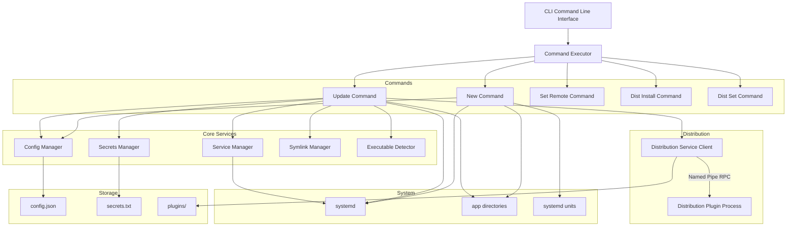
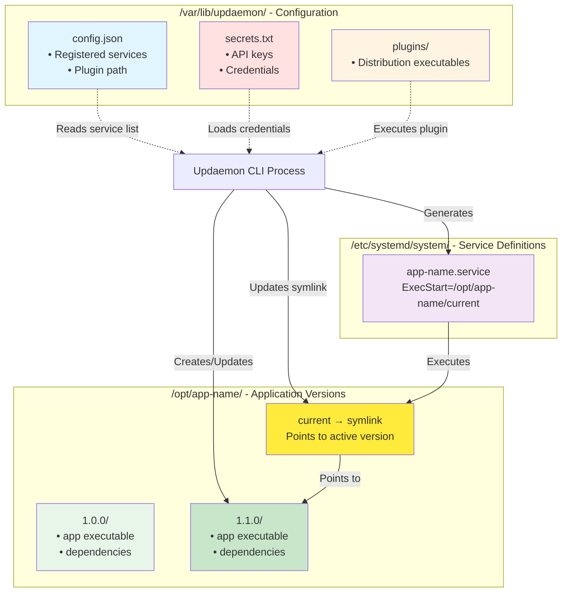
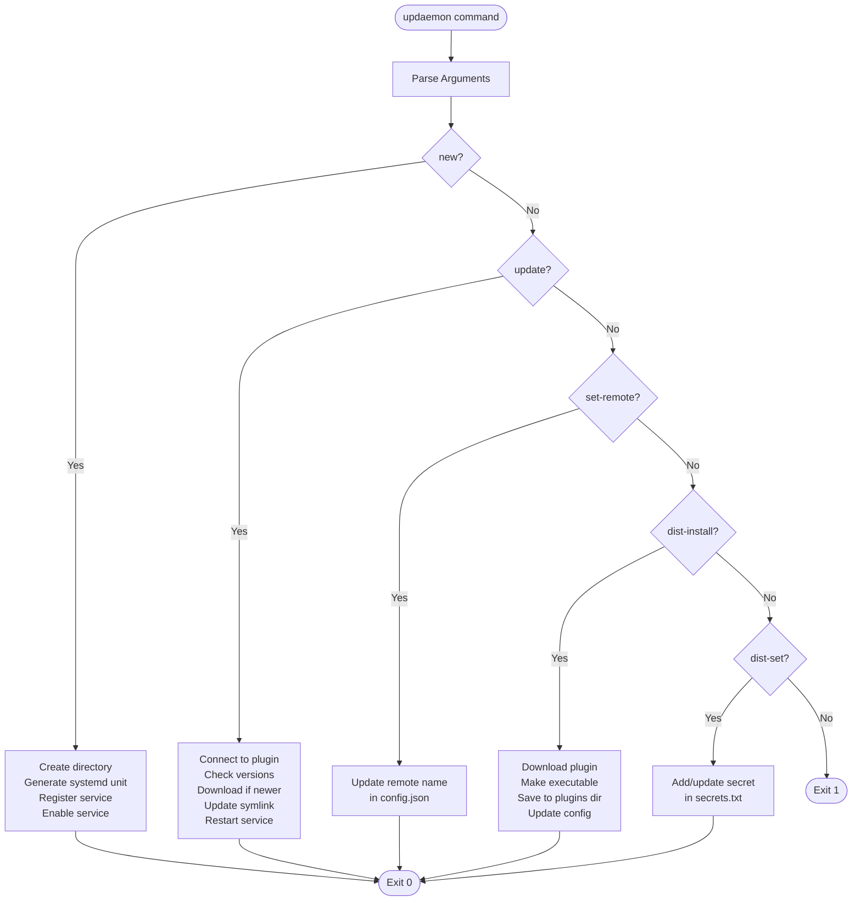

# Updaemon

A lightweight, AOT-compiled service update daemon for Linux that automatically keeps your services up to date through pluggable distribution sources.

## Overview

Updaemon is a CLI-based update manager designed to:
- Manage versioned deployments of services in `/opt/<service-name>/`
- Support pluggable distribution services via named pipes (AOT-compatible)
- Automatically update services from remote distribution sources
- Manage systemd service files and lifecycle
- Use symlinks for zero-downtime version switching

## System Architecture



## Update Flow


## Plugin Communication Architecture


## File System Data Flow



## CLI Command Flow



## Installation

### Building from Source

```bash
# Clone the repository
git clone <repository-url>
cd Updaemon

# Publish as AOT-compiled executable
dotnet publish Updaemon/Updaemon.csproj -c Release

# The executable will be in: Updaemon/bin/Release/net8.0/linux-x64/publish/
```

### Installing Updaemon

```bash
# Copy to system location
sudo cp Updaemon/bin/Release/net8.0/linux-x64/publish/Updaemon /usr/local/bin/updaemon
sudo chmod +x /usr/local/bin/updaemon

# Create configuration directory
sudo mkdir -p /var/lib/updaemon/plugins
```

## Usage

### Install a Distribution Plugin

```bash
# Install a distribution service plugin
sudo updaemon dist-install https://example.com/byteshelf-plugin

# Configure plugin secrets
sudo updaemon dist-set tenantId your-tenant-id
sudo updaemon dist-set apiKey your-api-key
```

### Create a New Service

```bash
# Create a new managed service
sudo updaemon new my-api

# Optionally set a different remote name
sudo updaemon set-remote my-api Prod.MyApi
```

This will:
- Create `/opt/my-api/` directory
- Generate systemd unit file at `/etc/systemd/system/my-api.service`
- Enable the service
- Register it in updaemon's configuration

### Update Services

```bash
# Update all registered services
sudo updaemon update

# Update a specific service
sudo updaemon update my-api
```

The update process:
1. Connects to the distribution plugin
2. Checks the latest available version
3. Downloads the new version to `/opt/my-api/<version>/`
4. Updates the symlink `/opt/my-api/current`
5. Restarts the service

### Running Periodic Updates

You can configure updaemon to run periodically using systemd timers:

```bash
# Create timer unit file
sudo cat > /etc/systemd/system/updaemon.timer <<EOF
[Unit]
Description=Run updaemon update periodically

[Timer]
OnCalendar=hourly
Persistent=true

[Install]
WantedBy=timers.target
EOF

# Create service unit file
sudo cat > /etc/systemd/system/updaemon.service <<EOF
[Unit]
Description=Updaemon update service

[Service]
Type=oneshot
ExecStart=/usr/local/bin/updaemon update
EOF

# Enable and start the timer
sudo systemctl enable updaemon.timer
sudo systemctl start updaemon.timer
```

## CLI Commands

### `updaemon new <app-name>`

Creates a new managed service with the specified name.

**Example:**
```bash
sudo updaemon new word-library-api
```

### `updaemon update [app-name]`

Updates all services or a specific service to the latest available version.

**Examples:**
```bash
sudo updaemon update                    # Update all services
sudo updaemon update word-library-api   # Update specific service
```

### `updaemon set-remote <app-name> <remote-name>`

Sets the remote name used when querying the distribution service for a specific app.

**Example:**
```bash
sudo updaemon set-remote word-library-api FastPackages.WordLibraryApi
```

### `updaemon dist-install <url>`

Downloads and installs a distribution service plugin from a URL.

**Example:**
```bash
sudo updaemon dist-install https://example.com/plugins/byteshelf-dist
```

### `updaemon dist-set <key> <value>`

Sets a secret key-value pair for the distribution service.

**Example:**
```bash
sudo updaemon dist-set apiKey abc123xyz
sudo updaemon dist-set tenantId 550e8400-e29b-41d4-a716-446655440000
```

## Directory Structure

```
/var/lib/updaemon/
├── config.json              # Service registry and plugin configuration
├── secrets.txt              # Distribution service secrets (key=value format)
└── plugins/
    └── <plugin-executable>  # Distribution service plugin

/opt/<service-name>/
├── 1.0.0/                   # Version 1.0.0 files
│   └── <executable>
├── 1.1.0/                   # Version 1.1.0 files
│   └── <executable>
└── current -> 1.1.0/<exe>   # Symlink to current version

/etc/systemd/system/
└── <service-name>.service   # systemd unit file
```

## Configuration Files

### /var/lib/updaemon/config.json

```json
{
  "distributionPluginPath": "/var/lib/updaemon/plugins/byteshelf-dist",
  "services": [
    {
      "localName": "word-library-api",
      "remoteName": "FastPackages.WordLibraryApi"
    }
  ]
}
```

### /var/lib/updaemon/secrets.txt

```
tenantId=550e8400-e29b-41d4-a716-446655440000
apiKey=abc123xyz
```

### App-specific Configuration (Optional)

Applications can include an `updaemon.json` file in their published output to provide hints to updaemon:

```json
{
  "executablePath": "bin/my-app"
}
```

## Creating Distribution Plugins

Distribution plugins are separate AOT-compiled executables that communicate with updaemon via named pipes using a JSON-RPC protocol.

### Plugin Requirements

1. Implement the `IDistributionService` interface:
   - `Task InitializeAsync(string? secrets)`
   - `Task<Version?> GetLatestVersionAsync(string serviceName)`
   - `Task DownloadVersionAsync(string serviceName, Version version, string targetPath)`

2. Accept `--pipe-name <name>` command-line argument

3. Host a named pipe server that handles JSON-RPC requests

4. Be compiled as an AOT executable for Linux

### RPC Protocol

**Request:**
```json
{
  "id": "unique-request-id",
  "method": "GetLatestVersionAsync",
  "parameters": "{\"serviceName\":\"MyApp\"}"
}
```

**Response:**
```json
{
  "id": "unique-request-id",
  "success": true,
  "result": "\"1.2.3\"",
  "error": null
}
```

## Architecture Decisions

### Why Named Pipes with JSON-RPC Instead of DLL Plugins?

AOT compilation doesn't support dynamic assembly loading at runtime. Named pipes with JSON-RPC allow us to:
- Keep plugins as separate processes
- Maintain AOT compatibility (using System.Text.Json source generation)
- Isolate plugin failures from updaemon
- Support plugins written in any language
- Human-readable messages for debugging

### Why System.Version?

Using `System.Version` provides:
- Standardized semantic versioning
- Built-in comparison operators
- Clear contract between updaemon and plugins

### Why Symlinks?

Symlinks enable:
- Zero-downtime deployments
- Easy rollback (just repoint the symlink)
- Multiple versions coexisting on disk
- Atomic version switching

## License

[Add your license here]

## Contributing

[Add contribution guidelines here]

